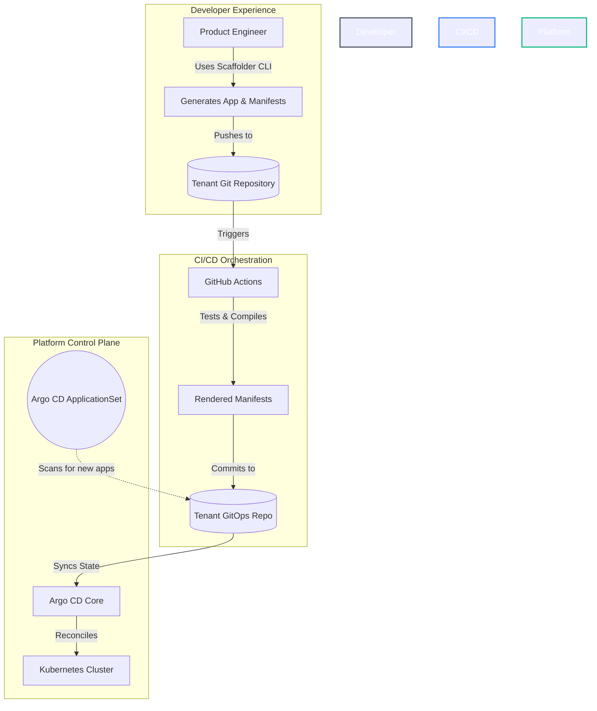

# 🏛️ Platform Engineering: IDP & GitOps Reference Architecture

An enterprise-grade **Internal Developer Platform (IDP)** blueprint designed for zero-touch onboarding, strict policy governance, and seamless multi-tenant continuous delivery via GitOps.

This repository serves as a reference architecture for platform teams looking to build "Local-to-Cloud" environments where developers are shielded from infrastructure complexity while retaining full deployment autonomy.

---

## 🏗️ Platform as a Product (Architecture Summary)

As cloud-native architectures scale, cognitive load on product engineering teams becomes a critical bottleneck. This reference architecture is built on the philosophy of **Platform-as-a-Product**. The platform itself is the product, and the application teams are its customers.

We deliver this product experience through four core pillars:
* **The UX (Golden Paths):** Curated, paved-road templates that provide secure-by-default microservice runtimes and delivery pipelines.
* **The Self-Service Portal (Go CLI):** A custom Golang CLI that allows developers to instantly scaffold applications, GitOps manifests, and infrastructure without platform team intervention.
* **The Stable API (Versioned IaC):** Infrastructure-as-Code is abstracted into reusable, version-pinned AWS Terraform modules (`?ref=vX`), ensuring we never break our customers.
* **The Reconciliation Engine (GitOps):** Strict unidirectional state flow. ArgoCD auto-discovers workloads via ApplicationSets, while Terraform state is strictly isolated per-service-per-environment to minimize blast radius.

---

## 📂 Project Structure & Reading Guide (Start Here)

To make it easier to understand how this platform operates from end-to-end, the repository is logically divided into chronological layers:

1. **`1-platform-catalog/` (The Platform's Offering)**  
   `catalog.yaml` declares the golden paths, the offered runtimes, the version-pinned capability → Terraform module mapping, and a `destinations:` table that is the platform's output contract. Alongside it sit three directories distinguished by *what happens to the files in them*: `blueprints/` is copied once per team, `building-blocks/` is copied per service, and `charts/` is never copied at all — CI renders it and only the output reaches a tenant repo. Templates use `[[ .Var ]]` syntax so Helm's `{{ }}` passes through untouched.
2. **`2-idp-scaffolder/golang/` (Go Scaffolder Engine)**  
   Go CLI implementation using **Cobra** and native `text/template` to render microservice workloads. This is the definitive engine.
3. **`2-idp-scaffolder/python/` (Python Scaffolder Engine & REST API)**  
   Python CLI and FastAPI REST service using **Typer**, **Jinja2** (configured with Go's `[[ ]]` delimiters) and **pydantic** validation, plus deterministic IP Address Management (IPAM) for tenant VPCs. It implements the *same two verbs against the same catalog* — see [One Catalog, Two Engines](#-one-catalog-two-engines) below for why.
4. **`3-tenant-workloads/` (Simulated Monorepo)**  
   The generated output, organised tenant-first as `<team>/{apps,infra,gitops}/` — each of those three maps to a standalone repo in production. `apps/` always means team-owned per-service content; the enclosing repo kind says whether that is source code, Terraform, or Helm values. There is no `<system>/` directory level — Backstage's System grouping lives in `catalog-info.yaml` instead. Inside `infra/` and `gitops/`, `platform/` is platform-owned, and a CODEOWNERS at each of the three roots makes that enforceable. ArgoCD monitors the CI-rendered `manifests/` directories for automatic deployment.
5. **`4-platform-engineering/` (Platform Infrastructure & Control Plane)**  
   Contains reusable AWS Terraform modules (`cloud-services-terraform-modules/`), ArgoCD App-of-Apps declarations (`argocd-apps/`), Traefik ingress controller setup, and OpenTelemetry observability configurations.

---

## 📜 The Output Contract

The catalog has three top-level directories, and the thing that distinguishes them is **what happens to the files inside**:

| Catalog directory | Rendered by | When | What reaches a tenant repo |
| :--- | :--- | :--- | :--- |
| `blueprints/` | Scaffolder CLI / API — `onboard-team` | once per team | the files themselves, copied |
| `building-blocks/` | Scaffolder CLI / API — `add-service` | once per service | the files themselves, copied |
| `charts/` | **GitHub Actions**, never the CLI | every push touching a `values.yaml` or the chart | **only its rendered output**, into `manifests/` |

That third row is the one people trip over. The chart is *not* a template the scaffolder copies — nothing under `charts/` ever appears in `3-tenant-workloads/`. One platform-owned chart serves every service, CI runs `helm template` against each app's `values.yaml`, and only the resulting plain YAML is committed. A chart fix therefore ships fleet-wide instead of being copy-pasted into N repos, and ArgoCD syncs `manifests/` only.

The first two directories are also laid out differently from each other, on purpose. `blueprints/` is walked and copied wholesale, so it mirrors the tree it produces. `building-blocks/` is *selected from* by name — `runtime: go`, `capabilities: [postgres]` — so it is organised by the keys `catalog.yaml` uses to address it. Two different access patterns, two different layouts.

What ties the catalog to its output is therefore not the directory names but this table:

| Catalog source | Rendered | Lands at |
| :--- | :--- | :--- |
| `blueprints/team/apps/` | once per team | `<team>/apps/` |
| `blueprints/team/infra/` | once per team | `<team>/infra/` |
| `blueprints/team/gitops/` | once per team | `<team>/gitops/` |
| `building-blocks/runtimes/<lang>/` | per service | `<team>/apps/<app>/` |
| `building-blocks/service-meta/` | per service | `<team>/apps/<app>/` |
| `building-blocks/capabilities/<cap>.tf.tmpl` | per service, per capability | `<team>/infra/apps/<app>/<env>/` |
| `building-blocks/delivery/release/` | per service | `<team>/gitops/apps/<app>/<env>/` |
| `charts/service/` | **never scaffolded** | CI renders it into `<team>/gitops/apps/<app>/<env>/manifests/` |

Every row except the last is the `destinations:` block in `catalog.yaml`, verbatim — the CLI reads that same data to decide where to write, so this table cannot drift from the code. Restructuring `3-tenant-workloads/` is a YAML edit, not a Go change.

The last row is the exception worth understanding: **the chart is never copied into a tenant repo.** One platform-owned chart serves every service, so a chart fix ships fleet-wide instead of being copy-pasted into N repos. Teams own `values.yaml`; the platform owns the chart; CI renders one against the other and commits only the result. That is why it lives in `charts/` rather than `building-blocks/` — everything under `building-blocks/` gets copied, and this gets rendered.

### Seeing it

One command shows the entire mapping better than any diagram:

```console
$ make demo-add-service DEMO_TEAM=payments DEMO_APP=checkout-api

Generating app 'checkout-api' [Runtime: go, Capabilities: [postgres]]
building-blocks/runtimes/go/go.mod.tmpl              --> payments/apps/checkout-api/go.mod
building-blocks/runtimes/go/main.go.tmpl             --> payments/apps/checkout-api/main.go
building-blocks/service-meta/catalog-info.yaml.tmpl  --> payments/apps/checkout-api/catalog-info.yaml
building-blocks/delivery/release/values.yaml.tmpl    --> payments/gitops/apps/checkout-api/dev/values.yaml
Adding infrastructure capability: postgres
building-blocks/capabilities/postgres.tf.tmpl        --> payments/infra/apps/checkout-api/dev/postgres.tf
```

Five files, three would-be repos, one command. Note what is absent: no `Chart.yaml`, no Helm packaging in `apps/`, and nothing written outside `dev/` — production requires a deliberate promotion PR.

The CLI itself writes to the current directory and appends nothing to it, the same contract as `terraform` or `npm`. `make demo-add-service` passes `--output-root "$(git rev-parse --show-toplevel)/3-tenant-workloads"`, so the simulation path is named in the Makefile rather than compiled into a binary other people would run.

### Monorepo authoring, polyrepo delivery

`3-tenant-workloads/` is the **authoring** format. The production format is three repos per team, and the transformation is not a feature that needs writing — it is `git subtree split`, whose prefixes the layout was designed around:

```console
$ git subtree split --prefix=3-tenant-workloads/team-a/apps
1f8a94e38604a7ff63e3e2d909fab5ecca8279af

$ git ls-tree -r --name-only 1f8a94e3
CODEOWNERS
app-a/catalog-info.yaml
app-a/go.mod
app-a/main.go
```

Run it yourself. Those are real commits carrying the full history of that prefix, not a plan — though the SHA is derived from that history, so yours will differ once anything new lands under `team-a/apps/`. The tree listing is the part that matters.

Notice what the split removes. In the monorepo the path is `team-a/apps/app-a/main.go`; in the resulting `<org>/team-a-apps` repo it is `app-a/main.go`. The `{team}/` and `apps/` segments exist in the view that needs them — telling teams and artifact kinds apart in one tree — and vanish from the view where they would be noise, because a repo that already *is* team-a's application code does not need to say so twice. `CODEOWNERS` lands at the split repo's root, which is the only place GitHub honours it.

That is why there is no `--layout` flag. A second output mode would mean a second code path to keep in sync and a mode for a user to get wrong; the split gives the same result with neither.

---

## 🗺️ Architectural Topologies

### 1. The GitOps Reconciliation Loop
This platform enforces a strict, unidirectional flow of state. Kubernetes is treated as the source of truth, and Argo CD acts as the reconciliation engine.



### 2. Zero-Touch Multi-Tenant Auto-Discovery
To scale across hundreds of microservices, we utilize **Argo CD ApplicationSets**. Instead of manually mapping each microservice to an Argo CD `Application` resource, discovery is two-level: a cluster-wide bootstrap ApplicationSet globs `3-tenant-workloads/*/gitops/platform/applicationsets` to apply each team's system ApplicationSets, and each of those in turn globs `3-tenant-workloads/<team>/gitops/apps/*/*` (app × env) to provision and isolate tenant applications on the fly.

### 3. Multi-Tenancy: What the Boundary Is, and Isn't

The design premise is **namespace-per-team in a shared cluster** — what almost every
company below hyperscale actually runs. `onboard-team` renders a full control stack per
namespace: an ArgoCD `AppProject` (what ArgoCD may deploy), a `NetworkPolicy` set (what
pods may talk to), a `ResourceQuota` + `LimitRange` (what may be consumed), Pod Security
Admission at `restricted` (what a pod may do to the node), and an RBAC `Role`/`RoleBinding`
(what a human may do with `kubectl` — read and debug only; writes go through git, which is
the entire point of the reconciliation loop).

**Namespaces are a cooperative boundary, not a security boundary.** Every tenant shares a
kernel, a control plane, and nodes. The controls above are correct and sufficient for
*internal teams who are not adversaries*, which is the realistic case for almost every
organization that will ever run this platform. They are not sufficient for hostile
multi-tenancy (e.g. running untrusted third-party code).

The escalation ladder, named without being implemented, because none of it is justified
below roughly 1000 engineers:

1. Node pools with per-tenant taints/tolerations — cheapest, still shared kernel.
2. gVisor / Kata Containers — kernel-level isolation, same cluster.
3. vCluster — isolated control plane, shared nodes.
4. Separate clusters — full isolation, full operational cost.

---

## 🔬 One Catalog, Two Engines

Most reference architectures claim their catalog is "the contract" and leave it at that. Here the claim is **falsifiable**.

`1-platform-catalog/catalog.yaml` is consumed by two independent implementations — Go (`text/template`, Cobra) and Python (Jinja2, Typer, pydantic). Run both with the same inputs and diff the trees:

```bash
diff -r /tmp/go-out/3-tenant-workloads/payments 3-tenant-workloads/payments
```

If the output differs, one of two things is true: the engines have drifted, or the catalog is under-specified about something both had to guess. Both are findings worth having. **Today the two trees are byte-identical** — every file, both verbs.

This is also why the templates carry no logic beyond one conditional, why output paths live in `catalog.yaml`'s `destinations:` table rather than in either codebase, and why both engines validate the same required keys at load time. A contract that only one implementation reads is just a config file.

> Two engines is a deliberate teaching choice, not a production recommendation. In a real platform you would ship one and spend the saved effort on Day-2 concerns — `--dry-run`, idempotent regeneration, catalog version pinning. Those are exactly the items in the two `TODO.md` files.

---

## 🧰 Component Matrix

This blueprint integrates best-in-class cloud-native tooling to form a cohesive ecosystem:

| Capability | Technology | Architectural Purpose |
| :--- | :--- | :--- |
| **Local Cluster** | **K3d (K3s)** | Lightweight, ephemeral Kubernetes environment optimized for ARM64/Silicon. |
| **GitOps Engine** | **Argo CD** | Declarative CD, state reconciliation, and multi-tenant auto-discovery. |
| **Infra as Code** | **Terraform** | Version-pinned modules (`4-platform-engineering/cloud-services-terraform-modules/`), claimed per-capability via `catalog.yaml` and scaffolded into each service's `infra/apps/<app>/<env>/`. |
| **Policy as Code** | **Kyverno** | Admission control. Enforces cluster security boundaries and standards. |
| **Prog. Delivery** | **Argo Rollouts** | Automated Canary & Blue-Green deployments integrated with edge routing. |
| **Edge Gateway** | **Traefik** | L7 ingress, API gateway, rate-limiting, and middleware injection. |
| **Secrets Ops** | **Sealed Secrets** | Asymmetric encryption enabling safe storage of secrets in Git. |
| **Observability** | **Grafana Stack**| Unified metrics (Prometheus), logs (Loki), and traces (Tempo). |
| **Dep. Management**| **Renovate** | Automated dependency bumps. `go.mod` and `pyproject.toml` are covered by the built-in managers; one custom regex manager handles the version pins in `catalog.yaml`, which no package manager understands. |

---

> **Known gap — infrastructure is an open loop.** `add-service --capabilities postgres`
> scaffolds `3-tenant-workloads/<team>/infra/apps/<app>/<env>/postgres.tf`, but nothing in
> this repo ever runs `terraform apply` against it. CI
> (`.github/workflows/tenant-workloads-ci-cd.yaml`) builds images and runs `helm template`
> only — there is no Terraform runner, no state backend, and no plan/apply gate. App
> delivery (the GitOps path) is a closed loop; infrastructure delivery is not. A developer
> asking for a database today receives a text file, not a database. Closing this loop —
> either a Terraform runner (plan-on-PR, apply-on-merge) or moving cheap/recreatable
> capabilities to a continuously-reconciling controller — is the next infrastructure
> milestone.

## 🚀 Deployment Guide (Local Demo Mode)

You can spin up this entire reference architecture locally to evaluate the developer experience and platform guardrails. We provide a `Makefile` to simplify the setup process.

### 1. Provision the Ephemeral Cluster
```bash
make create-cluster
```

### 2. Install the GitOps Engine (Argo CD)
```bash
make install-argocd
```

### 3. Bootstrap the Platform
The `bootstrap.yaml` file acts as the root of the "App of Apps" pattern. It points Argo CD to the `4-platform-engineering/argocd-apps/` directory to deploy all cluster add-ons simultaneously.
```bash
make bootstrap
```

> **Tip:** You can also run `make setup` to perform all cluster provisioning, Argo CD installation, and bootstrapping in one command.

### 4. Scaffold a New Microservice
Emulate a developer onboarding a new service. The generator builds the source code, pipelines, and GitOps configurations.
The Go CLI exposes two lifecycle verbs, each idempotent at a different scope:

```bash
cd 2-idp-scaffolder/golang

# 1. Once per team — tenancy boundary (AppProject, Namespace, NetworkPolicy, team IAM)
#    plus the ArgoCD ApplicationSet that auto-discovers everything the team owns
go run . onboard-team --catalog-root ../../1-platform-catalog --team-name payments

# 2. Repeatable — a golden path: runtime + capabilities + delivery values + catalog-info
go run . add-service --catalog-root ../../1-platform-catalog \
                     --team-name payments --app-name checkout-api \
                     --golden-path go-service-postgres --system checkout
```

`--golden-path` seeds the runtime and capabilities from `catalog.yaml`; `--runtime` and
`--capabilities` override or extend that seed. `--system` is optional Backstage metadata;
it groups services in the service catalog and creates no directory.

> **`--catalog-root` matters.** Without it the CLI fetches the catalog from GitHub, so your
> local edits to `1-platform-catalog/` will not take effect until pushed. `--output-root`
> likewise redirects the generated tree somewhere other than `3-tenant-workloads/`.

The same verbs in the Python engine, which also exposes them over REST:

```bash
cd 2-idp-scaffolder/python && uv sync

uv run python main.py onboard-team --team-name payments
uv run python main.py add-service --team-name payments --app-name checkout-api \
                      --golden-path go-service-postgres

make run-api      # FastAPI on the same engine; open /docs for the OpenAPI UI
```

> **Not yet idempotent.** Both engines use truncating writes, so re-running `add-service`
> overwrites edits to a previously scaffolded file. Skip-if-exists and a working
> `--dry-run` are the next items in both `TODO.md` files.

---

## 🛠️ Operations Guide

### Updating ArgoCD Applications
If you make changes to the YAML files inside the `4-platform-engineering/` directory, ArgoCD is configured to automatically sync the changes from the `main` branch. 
To manually trigger a sync or force an update without waiting for Git polling, you can apply the bootstrap file again:
```bash
make bootstrap
```
Or force a sync via the ArgoCD CLI:
```bash
argocd app sync platform-bootstrap
```

### Tearing Down the Cluster
To delete the ephemeral cluster and completely destroy the environment, run:
```bash
make destroy
```
This will remove the cluster (via K3d/Kind/Minikube) and clean up all resources.

---

## 🔮 Future Roadmap

To mature this architecture for production environments, the following capabilities are roadmapped:

- [ ] **Backstage Integration:** Migrating the python CLI generator into Backstage Software Templates for a unified GUI developer portal.
- [ ] **AIOps / Observability:** Full instrumentation using OpenTelemetry to map service dependencies and reduce MTTR via correlation.
- [ ] **FinOps Automation:** Operator-driven cost controls to scale non-production idle workloads to zero using KEDA.
- [ ] **Cross-Cloud Capabilities:** Expanding Crossplane Compositions to support Azure AKS and GCP GKE multi-cloud environments.
