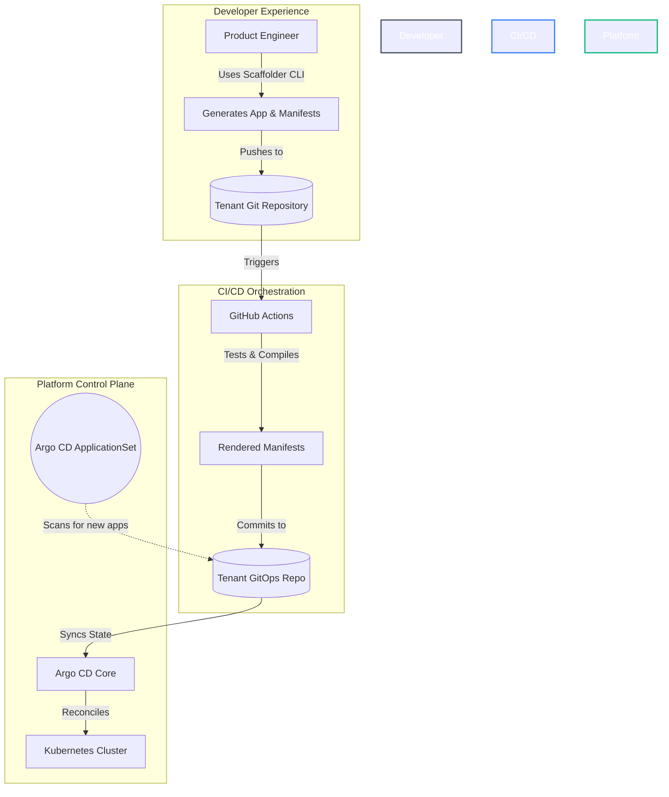

# 🏛️ Platform Engineering: IDP & GitOps Reference Architecture

An enterprise-grade **Internal Developer Platform (IDP)** blueprint designed for zero-touch onboarding, strict policy governance, and seamless multi-tenant continuous delivery via GitOps.

This repository serves as a reference architecture for platform teams looking to build "Local-to-Cloud" environments where developers are shielded from infrastructure complexity while retaining full deployment autonomy.

---

## 🏗️ Platform as a Product (Architecture Summary)

As cloud-native architectures scale, cognitive load on product engineering teams becomes a critical bottleneck. This reference architecture is built on the philosophy of **Platform-as-a-Product**. The platform itself is the product, and the application teams are its customers.

We deliver this product experience through four core pillars:
* **The UX (Golden Paths):** Curated, paved-road templates that provide secure-by-default microservice runtimes and delivery pipelines.
* **The Self-Service Portal (Go CLI):** A custom Golang CLI that allows developers to instantly scaffold applications, GitOps manifests, and infrastructure without platform team intervention.
* **The Stable API (Versioned IaC):** Infrastructure-as-Code is abstracted into reusable, version-pinned AWS Terraform modules (`?ref=vX`), ensuring we never break our customers.
* **The Reconciliation Engine (GitOps):** Strict unidirectional state flow. ArgoCD auto-discovers workloads via ApplicationSets, while Terraform state is strictly isolated per-service-per-environment to minimize blast radius.

---

## 📂 Project Structure & Reading Guide (Start Here)

To make it easier to understand how this platform operates from end-to-end, the repository is logically divided into chronological layers:

1. **`1-platform-catalog/` (The Platform's Offering)**  
   `catalog.yaml` declares the golden paths, the version-pinned capability → Terraform module mapping, and a `destinations:` table that is the platform's output contract. Alongside it, `blueprints/` (rendered once per team or system) and `building-blocks/` (composed per service) hold the templates themselves, in `[[ .Var ]]` syntax so Helm's `{{ }}` passes through untouched.
2. **`2-idp-scaffolder/golang/` (Go Scaffolder Engine)**  
   Go CLI implementation using **Cobra** and native `text/template` engine to render microservice workloads.
3. **`2-idp-scaffolder/python/` (Python Scaffolder Engine & REST API)**  
   Python CLI and FastAPI REST service utilizing **Typer** and **Copier** with deterministic IP Address Management (IPAM) for tenant VPCs.
4. **`3-tenant-workloads/` (Simulated Monorepo)**  
   The generated output, organised tenant-first as `<team>/{apps,infra,gitops}/` — each of those three maps to a standalone repo in production. `apps/` always means team-owned per-service content; the enclosing repo kind says whether that is source code, Terraform, or Helm values. There is no `<system>/` directory level — Backstage's System grouping lives in `catalog-info.yaml` instead. Inside `infra/` and `gitops/`, `platform/` is platform-owned, and a CODEOWNERS at each of the three roots makes that enforceable. ArgoCD monitors the CI-rendered `manifests/` directories for automatic deployment.
5. **`4-platform-engineering/` (Platform Infrastructure & Control Plane)**  
   Contains reusable AWS Terraform modules (`cloud-services-terraform-modules/`), ArgoCD App-of-Apps declarations (`argocd-apps/`), Traefik ingress controller setup, and OpenTelemetry observability configurations.

---

## 🗺️ Architectural Topologies

### 1. The GitOps Reconciliation Loop
This platform enforces a strict, unidirectional flow of state. Kubernetes is treated as the source of truth, and Argo CD acts as the reconciliation engine.



### 2. Zero-Touch Multi-Tenant Auto-Discovery
To scale across hundreds of microservices, we utilize **Argo CD ApplicationSets**. Instead of manually mapping each microservice to an Argo CD `Application` resource, discovery is two-level: a cluster-wide bootstrap ApplicationSet globs `3-tenant-workloads/*/gitops/platform/applicationsets` to apply each team's system ApplicationSets, and each of those in turn globs `3-tenant-workloads/<team>/gitops/apps/*/*` (app × env) to provision and isolate tenant applications on the fly.

---

## 🧰 Component Matrix

This blueprint integrates best-in-class cloud-native tooling to form a cohesive ecosystem:

| Capability | Technology | Architectural Purpose |
| :--- | :--- | :--- |
| **Local Cluster** | **K3d (K3s)** | Lightweight, ephemeral Kubernetes environment optimized for ARM64/Silicon. |
| **GitOps Engine** | **Argo CD** | Declarative CD, state reconciliation, and multi-tenant auto-discovery. |
| **Infra as Code** | **Crossplane** | Abstracts AWS/Azure infrastructure into higher-level Kubernetes `Claims`. |
| **Policy as Code** | **Kyverno** | Admission control. Enforces cluster security boundaries and standards. |
| **Prog. Delivery** | **Argo Rollouts** | Automated Canary & Blue-Green deployments integrated with edge routing. |
| **Edge Gateway** | **Traefik** | L7 ingress, API gateway, rate-limiting, and middleware injection. |
| **Secrets Ops** | **Sealed Secrets** | Asymmetric encryption enabling safe storage of secrets in Git. |
| **Observability** | **Grafana Stack**| Unified metrics (Prometheus), logs (Loki), and traces (Tempo). |
| **Dep. Management**| **Renovate** | Automated dependency bumps for Terraform modules, Helm charts, and Python packages via custom Regex Managers. |

---

## 🚀 Deployment Guide (Local Demo Mode)

You can spin up this entire reference architecture locally to evaluate the developer experience and platform guardrails. We provide a `Makefile` to simplify the setup process.

### 1. Provision the Ephemeral Cluster
```bash
make create-cluster
```

### 2. Install the GitOps Engine (Argo CD)
```bash
make install-argocd
```

### 3. Bootstrap the Platform
The `bootstrap.yaml` file acts as the root of the "App of Apps" pattern. It points Argo CD to the `4-platform-engineering/argocd-apps/` directory to deploy all cluster add-ons simultaneously.
```bash
make bootstrap
```

> **Tip:** You can also run `make setup` to perform all cluster provisioning, Argo CD installation, and bootstrapping in one command.

### 4. Scaffold a New Microservice
Emulate a developer onboarding a new service. The generator builds the source code, pipelines, and GitOps configurations.
The Go CLI exposes two lifecycle verbs, each idempotent at a different scope:

```bash
cd 2-idp-scaffolder/golang

# 1. Once per team — tenancy boundary (AppProject, Namespace, NetworkPolicy, team IAM)
#    plus the ArgoCD ApplicationSet that auto-discovers everything the team owns
go run . onboard-team --team-name payments

# 2. Repeatable — a golden path: runtime + capabilities + delivery values + catalog-info
go run . add-service --team-name payments --app-name checkout-api \
                     --golden-path go-service-postgres --system checkout
```

`--system` is optional Backstage metadata; it groups services in the service catalog and
creates no directory.

`--golden-path` seeds the runtime and capabilities from `catalog.yaml`; `--runtime` and
`--capabilities` override or extend that seed.

> **Note:** the Python CLI (`2-idp-scaffolder/python/`) is currently non-functional pending a
> repoint at `1-platform-catalog/`.

---

## 🛠️ Operations Guide

### Updating ArgoCD Applications
If you make changes to the YAML files inside the `4-platform-engineering/` directory, ArgoCD is configured to automatically sync the changes from the `main` branch. 
To manually trigger a sync or force an update without waiting for Git polling, you can apply the bootstrap file again:
```bash
make bootstrap
```
Or force a sync via the ArgoCD CLI:
```bash
argocd app sync platform-bootstrap
```

### Tearing Down the Cluster
To delete the ephemeral cluster and completely destroy the environment, run:
```bash
make destroy
```
This will remove the cluster (via K3d/Kind/Minikube) and clean up all resources.

---

## 🔮 Future Roadmap

To mature this architecture for production environments, the following capabilities are roadmapped:

- [ ] **Backstage Integration:** Migrating the python CLI generator into Backstage Software Templates for a unified GUI developer portal.
- [ ] **AIOps / Observability:** Full instrumentation using OpenTelemetry to map service dependencies and reduce MTTR via correlation.
- [ ] **FinOps Automation:** Operator-driven cost controls to scale non-production idle workloads to zero using KEDA.
- [ ] **Cross-Cloud Capabilities:** Expanding Crossplane Compositions to support Azure AKS and GCP GKE multi-cloud environments.
