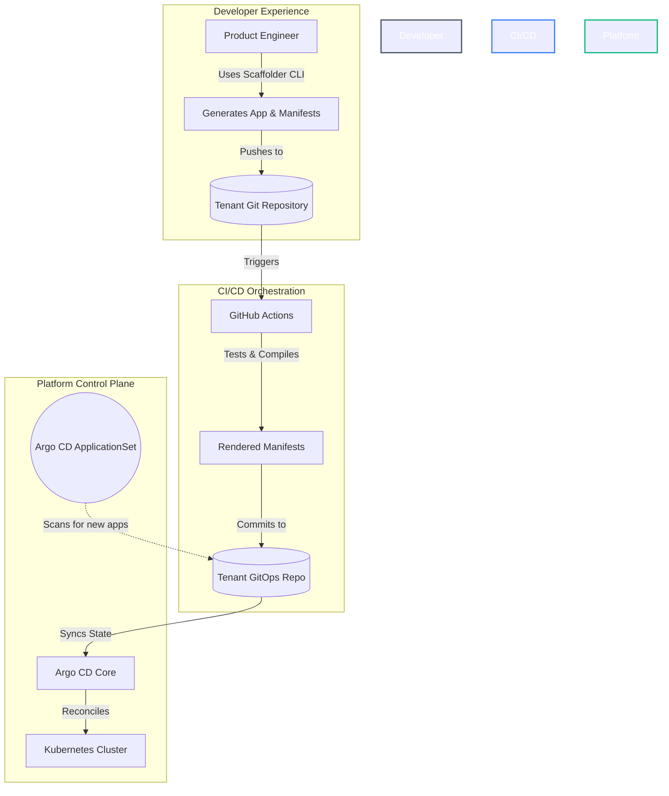

# 🏛️ Platform Engineering: IDP & GitOps Reference Architecture

An enterprise-grade **Internal Developer Platform (IDP)** blueprint designed for zero-touch onboarding, strict policy governance, and seamless multi-tenant continuous delivery via GitOps.

This repository serves as a reference architecture for platform teams looking to build "Local-to-Cloud" environments where developers are shielded from infrastructure complexity while retaining full deployment autonomy.

---

## 🏗️ Platform as a Product (Architecture Summary)

As cloud-native architectures scale, cognitive load on product engineering teams becomes a critical bottleneck. This reference architecture is built on the philosophy of **Platform-as-a-Product**. The platform itself is the product, and the application teams are its customers.

We deliver this product experience through four core pillars:
* **The UX (Golden Paths):** Curated, paved-road templates that provide secure-by-default microservice runtimes and delivery pipelines.
* **The Self-Service Portal (Go CLI):** A custom Golang CLI that allows developers to instantly scaffold applications, GitOps manifests, and infrastructure without platform team intervention.
* **The Stable API (Versioned IaC):** Infrastructure-as-Code is abstracted into reusable, version-pinned AWS Terraform modules (`?ref=vX`), ensuring we never break our customers.
* **The Reconciliation Engine (GitOps):** Strict unidirectional state flow. ArgoCD auto-discovers workloads via ApplicationSets, while Terraform state is strictly isolated per-service-per-environment to minimize blast radius.

---

## 📂 Project Structure & Reading Guide (Start Here)

To make it easier to understand how this platform operates from end-to-end, the repository is logically divided into chronological layers:

1. **`1-platform-catalog/` (The Platform's Offering)**  
   `catalog.yaml` declares the golden paths, the offered runtimes, the version-pinned capability → Terraform module mapping, and a `destinations:` table that is the platform's output contract. Alongside it sit three directories distinguished by *what happens to the files in them*: `blueprints/` is copied once per team, `building-blocks/` is copied per service, and `charts/` is never copied at all — CI renders it and only the output reaches a tenant repo. Templates use `[[ .Var ]]` syntax so Helm's `{{ }}` passes through untouched.
2. **`2-idp-scaffolder/golang/` (Go Scaffolder Engine)**  
   Go CLI implementation using **Cobra** and native `text/template` to render microservice workloads. This is the definitive engine.
3. **`2-idp-scaffolder/python/` (Python Scaffolder Engine & REST API)**  
   Python CLI and FastAPI REST service using **Typer**, **Jinja2** (configured with Go's `[[ ]]` delimiters) and **pydantic** validation, plus deterministic IP Address Management (IPAM) for tenant VPCs. It implements the *same two verbs against the same catalog* — see [One Catalog, Two Engines](#-one-catalog-two-engines) below for why.
4. **`3-tenant-workloads/` (Simulated Monorepo)**  
   The generated output, organised tenant-first as `<team>/{apps,infra,gitops}/` — each of those three maps to a standalone repo in production. `apps/` always means team-owned per-service content; the enclosing repo kind says whether that is source code, Terraform, or Helm values. There is no `<system>/` directory level — Backstage's System grouping lives in `catalog-info.yaml` instead. Inside `infra/` and `gitops/`, `platform/` is platform-owned, and a CODEOWNERS at each of the three roots makes that enforceable. ArgoCD monitors the CI-rendered `manifests/` directories for automatic deployment.
5. **`4-platform-engineering/` (Platform Infrastructure & Control Plane)**  
   Numbered in order of operations: `1-cloud-foundation/` is Terraform the platform team applies before a cluster exists (`aws/` nested by provider, `local/` for the k3d test harness); `2-cluster-services/` is portable ArgoCD `Application`/`ApplicationSet` declarations the platform team reconciles after a cluster exists — Traefik ingress, OpenTelemetry, observability, and security/governance, merged with the raw resources they deploy; `3-capability-modules/` holds the version-pinned AWS Terraform modules tenants consume via `catalog.yaml`; `4-platform-apis/` is empty until Phase 5. Each has its own `README.md`.

---

## 📜 The Output Contract

The catalog has three top-level directories, and the thing that distinguishes them is **what happens to the files inside**:

| Catalog directory | Rendered by | When | What reaches a tenant repo |
| :--- | :--- | :--- | :--- |
| `blueprints/` | Scaffolder CLI / API — `onboard-team` | once per team | the files themselves, copied |
| `building-blocks/` | Scaffolder CLI / API — `add-service` | once per service | the files themselves, copied |
| `charts/` | **GitHub Actions**, never the CLI | every push touching a `values.yaml` or the chart | **only its rendered output**, into `manifests/` |

That third row is the one people trip over. The chart is *not* a template the scaffolder copies — nothing under `charts/` ever appears in `3-tenant-workloads/`. One platform-owned chart serves every service, CI runs `helm template` against each app's `values.yaml`, and only the resulting plain YAML is committed. A chart fix therefore ships fleet-wide instead of being copy-pasted into N repos, and ArgoCD syncs `manifests/` only.

The first two directories are also laid out differently from each other, on purpose. `blueprints/` is walked and copied wholesale, so it mirrors the tree it produces. `building-blocks/` is *selected from* by name — `runtime: go`, `capabilities: [postgres]` — so it is organised by the keys `catalog.yaml` uses to address it. Two different access patterns, two different layouts.

What ties the catalog to its output is therefore not the directory names but this table:

| Catalog source | Rendered | Lands at |
| :--- | :--- | :--- |
| `blueprints/team/apps/` | once per team | `<team>/apps/` |
| `blueprints/team/infra/` | once per team | `<team>/infra/` |
| `blueprints/team/gitops/` | once per team | `<team>/gitops/` |
| `building-blocks/runtimes/<lang>/` | per service | `<team>/apps/<app>/` |
| `building-blocks/service-meta/` | per service | `<team>/apps/<app>/` |
| `building-blocks/capabilities/<cap>.tf.tmpl` | per service, per capability | `<team>/infra/apps/<app>/<env>/` |
| `building-blocks/delivery/release/` | per service | `<team>/gitops/apps/<app>/<env>/` |
| `charts/service/` | **never scaffolded** | CI renders it into `<team>/gitops/apps/<app>/<env>/manifests/` |

Every row except the last is the `destinations:` block in `catalog.yaml`, verbatim — the CLI reads that same data to decide where to write, so this table cannot drift from the code. Restructuring `3-tenant-workloads/` is a YAML edit, not a Go change.

The last row is the exception worth understanding: **the chart is never copied into a tenant repo.** One platform-owned chart serves every service, so a chart fix ships fleet-wide instead of being copy-pasted into N repos. Teams own `values.yaml`; the platform owns the chart; CI renders one against the other and commits only the result. That is why it lives in `charts/` rather than `building-blocks/` — everything under `building-blocks/` gets copied, and this gets rendered.

### Seeing it

One command shows the entire mapping better than any diagram:

```console
$ make demo-add-service DEMO_TEAM=payments DEMO_APP=checkout-api

Generating app 'checkout-api' [Runtime: go, Capabilities: [postgres]]
building-blocks/runtimes/go/go.mod.tmpl              --> payments/apps/checkout-api/go.mod
building-blocks/runtimes/go/main.go.tmpl             --> payments/apps/checkout-api/main.go
building-blocks/service-meta/catalog-info.yaml.tmpl  --> payments/apps/checkout-api/catalog-info.yaml
building-blocks/delivery/release/values.yaml.tmpl    --> payments/gitops/apps/checkout-api/dev/values.yaml
Adding infrastructure capability: postgres
building-blocks/capabilities/postgres.tf.tmpl        --> payments/infra/apps/checkout-api/dev/postgres.tf
```

Five files, three would-be repos, one command. Note what is absent: no `Chart.yaml`, no Helm packaging in `apps/`, and nothing written outside `dev/` — production requires a deliberate promotion PR.

The CLI itself writes to the current directory and appends nothing to it, the same contract as `terraform` or `npm`. `make demo-add-service` passes `--output-root "$(git rev-parse --show-toplevel)/3-tenant-workloads"`, so the simulation path is named in the Makefile rather than compiled into a binary other people would run.

### Monorepo authoring, polyrepo delivery

`3-tenant-workloads/` is the **authoring** format. The production format is three repos per team, and the transformation is not a feature that needs writing — it is `git subtree split`, whose prefixes the layout was designed around:

```console
$ git subtree split --prefix=3-tenant-workloads/team-a/apps
1f8a94e38604a7ff63e3e2d909fab5ecca8279af

$ git ls-tree -r --name-only 1f8a94e3
CODEOWNERS
app-a/catalog-info.yaml
app-a/go.mod
app-a/main.go
```

Run it yourself. Those are real commits carrying the full history of that prefix, not a plan — though the SHA is derived from that history, so yours will differ once anything new lands under `team-a/apps/`. The tree listing is the part that matters.

Notice what the split removes. In the monorepo the path is `team-a/apps/app-a/main.go`; in the resulting `<org>/team-a-apps` repo it is `app-a/main.go`. The `{team}/` and `apps/` segments exist in the view that needs them — telling teams and artifact kinds apart in one tree — and vanish from the view where they would be noise, because a repo that already *is* team-a's application code does not need to say so twice. `CODEOWNERS` lands at the split repo's root, which is the only place GitHub honours it.

That is why there is no `--layout` flag. A second output mode would mean a second code path to keep in sync and a mode for a user to get wrong; the split gives the same result with neither.

---

## 🗺️ Architectural Topologies

### 1. The GitOps Reconciliation Loop
This platform enforces a strict, unidirectional flow of state. Kubernetes is treated as the source of truth, and Argo CD acts as the reconciliation engine.



### 2. Zero-Touch Multi-Tenant Auto-Discovery
To scale across hundreds of microservices, we utilize **Argo CD ApplicationSets**. Instead of manually mapping each microservice to an Argo CD `Application` resource, discovery is two-level: a cluster-wide bootstrap ApplicationSet globs `3-tenant-workloads/*/gitops/platform/applicationsets` to apply each team's system ApplicationSets, and each of those in turn globs `3-tenant-workloads/<team>/gitops/apps/*/*` (app × env) to provision and isolate tenant applications on the fly.

### 3. Multi-Tenancy: What the Boundary Is, and Isn't

The design premise is **namespace-per-team in a shared cluster** — what almost every
company below hyperscale actually runs. `onboard-team` renders a full control stack per
namespace: an ArgoCD `AppProject` (what ArgoCD may deploy), a `NetworkPolicy` set (what
pods may talk to), a `ResourceQuota` + `LimitRange` (what may be consumed), Pod Security
Admission at `restricted` (what a pod may do to the node), and an RBAC `Role`/`RoleBinding`
(what a human may do with `kubectl` — read and debug only; writes go through git, which is
the entire point of the reconciliation loop).

**Namespaces are a cooperative boundary, not a security boundary.** Every tenant shares a
kernel, a control plane, and nodes. The controls above are correct and sufficient for
*internal teams who are not adversaries*, which is the realistic case for almost every
organization that will ever run this platform. They are not sufficient for hostile
multi-tenancy (e.g. running untrusted third-party code).

The escalation ladder, named without being implemented, because none of it is justified
below roughly 1000 engineers:

1. Node pools with per-tenant taints/tolerations — cheapest, still shared kernel.
2. gVisor / Kata Containers — kernel-level isolation, same cluster.
3. vCluster — isolated control plane, shared nodes.
4. Separate clusters — full isolation, full operational cost.

### 3.1 The Second Axis: Accounts, Not Namespaces

Everything above is the **soft** axis. Real organizations run a **hard** axis too, at a
different granularity:

| Axis | Unit | Boundary strength | Enforced by | Typical granularity |
|---|---|---|---|---|
| **Soft** | Namespace | cooperative | RBAC, ResourceQuota, NetworkPolicy, PSA | per **team** |
| **Hard** | AWS account | real — separate IAM, billing, blast radius | Organizations, SCPs | per **environment** |

The common shape is **not** "an account per team" and **not** "a namespace per team" — it
is **an account per environment, with a namespace per team inside it.** Teams share a
cluster; production does not share an account with development. ("Would you give every
team their own cluster?" is a standard interview probe — "no, and here is the axis I'd use
instead" is the answer that lands.)

AWS Organizations is the primitive: accounts, Organizational Units, and **SCPs**. The
mental model that matters: **an SCP is a permission ceiling, not a grant** — it cannot give
anyone access, only cap what any principal (including the account root) may do. That
inversion is what makes the account boundary *hard* where a NetworkPolicy is *soft*. Real,
`terraform validate`-clean HCL for this lives in
[`4-platform-engineering/1-cloud-foundation/aws/organization/`](4-platform-engineering/1-cloud-foundation/aws/organization/)
— two OUs (Production, NonProduction) and three SCPs (deny leaving the org, deny disabling
CloudTrail, deny regions outside `eu-central-1` as a data-residency control, not just a
latency one).

**Account vending is the same pattern as the scaffolder, one level up:**

| Step | `onboard-team` (soft axis) | Account Factory for Terraform (hard axis) |
|---|---|---|
| Request | `--team payments` | a vend-request PR |
| Validation | `catalog.yaml` required-fields check | AFT account-request schema |
| Baseline | `NetworkPolicy`, `ResourceQuota`, PSA label | SCPs, CloudTrail, GuardDuty, Config |
| Policy attach | `AppProject` whitelist, RBAC `Role` | OU placement, permission sets |
| Registration | ArgoCD `ApplicationSet` glob picks it up | account joins the Organization |

Same guarantees, different substrate: a git-reviewed request produces a governed unit with
policy already attached, no ClickOps. One is this platform's soft axis; AFT is AWS's
version of the hard one.

**Cross-account IAM for ACK — the fourth wall gets a real account behind it.** ACK
controllers run in the hub cluster (Phase 5.1) but must create resources in a tenant's
spoke account. The chain: `namespace → IRSA/Pod Identity role → assumed spoke-account role
→ blast radius is one tenant's AWS account`, not just an IAM policy condition. **The spoke
trusts the hub, never the reverse** — a spoke account grants a narrow, revocable door to
its own resources; the hub never widens its own trust boundary to let spokes in. See
[`ack-cross-account.tf`](4-platform-engineering/1-cloud-foundation/aws/organization/ack-cross-account.tf)
for the `sts:AssumeRole` + `ExternalId` trust policy this implies.

---

## 🔐 Identity & Single Sign-On (Phase 7)

Phase 1.1 binds the developer `Role` to `Group: oidc:<team>`. Before Phase 7, **that group
existed nowhere** — nothing issued it, nothing validated it, no human had ever
authenticated to this platform. "How do you stop team-a touching team-b?" has four
separate answers, not one, and conflating them is the most common mistake here:

| Plane | Question it answers | Enforced by |
|---|---|---|
| **Kubernetes API** | what can this human do with `kubectl`? | RBAC `Role`/`RoleBinding` |
| **ArgoCD** | who may sync/rollback which app? | `argocd-rbac-cm` `policy.csv` |
| **ArgoCD (deploy surface)** | what *kinds* may be deployed, and where? | `AppProject` |
| **Workload → cloud** | what may the *pod itself* do in AWS? | IRSA / Pod Identity |

The last plane is not a human plane at all — it answers "what can this pod do in AWS,"
which has nothing to do with who is running `kubectl`. Every plane is driven by **one**
group naming contract, chosen once and never varied: `platform:<team>:<tier>` (e.g.
`platform:team-a:developer`, `platform:team-a:oncall`).

**Keycloak is a self-hosted stand-in** for a corporate IdP (Entra ID / Okta) plus AWS IAM
Identity Center, chosen so the whole loop runs locally with no corporate tenant. The chain
a real AWS shop runs:

```
Corporate IdP (Entra ID / Okta) --SAML+SCIM--> IAM Identity Center --Permission Set-->
an IAM role vended per account --> EKS Access Entry (maps that role to a K8s group) -->
RoleBinding (unchanged)
```

On real EKS, human `kubectl` auth is **IAM Access Entries** (`1-cloud-foundation/aws/cluster-access/`),
not raw OIDC flags to the API server — those flags are the local k3d approximation only,
since k3d cannot rewire a running API server's auth once Keycloak exists (see the comment
in `Makefile`'s `create-cluster` target). ArgoCD, Grafana and Backstage are ordinary apps
with no AWS-native alternative, so they authenticate via plain OIDC against Keycloak
directly.

**External Secrets Operator, alongside Sealed Secrets, not replacing it.** Sealed Secrets
keeps ciphertext in git (auditable, offline, rotation is a re-seal); ESO keeps only a
reference in git and resolves the real value from AWS Secrets Manager at sync time
(rotation is free, but the cluster now depends on AWS being reachable). Both stay because
the trade-off differs by use case, not because one is strictly better. ESO authenticates
via the same IRSA/Pod Identity plane as everything else in this section — see
`4-platform-engineering/2-cluster-services/security-governance/external-secrets.yaml`.

**Verify — this is the demo, not a diagram:**

```bash
kubectl auth can-i get pods          -n team-a --as=dev --as-group=oidc:platform:team-a:developer  # yes
kubectl auth can-i create pods       -n team-a --as=dev --as-group=oidc:platform:team-a:developer  # no
kubectl auth can-i get pods          -n team-b --as=dev --as-group=oidc:platform:team-a:developer  # no
kubectl auth can-i create pods/exec  -n team-a --as=dev --as-group=oidc:platform:team-a:developer  # no
kubectl auth can-i create pods/exec  -n team-a --as=sre --as-group=oidc:platform:team-a:oncall      # yes
argocd account can-i sync applications 'team-b/*'   # no
```

**One group, every tool — the actual SSO deliverable:**

| Consumer | Protocol | Where the group is consumed | Grants |
|---|---|---|---|
| Kubernetes API | OIDC (local) / EKS Access Entry (real EKS) | `RoleBinding.subjects[].name` | read + logs in that team's namespaces |
| ArgoCD | OIDC via Keycloak's `argocd` client | `argocd-rbac-cm` `policy.csv` `g,` line | sync/rollback that team's apps only |
| Grafana | OIDC + `role_attribute_path` | org role mapping | Viewer/Editor for the platform team |
| Backstage | OIDC (`backstage` client) | entity ownership | sees its own components |
| AWS console/CLI | SAML → IAM Identity Center | Permission Set assignment | scoped to that team's account |

`platform:team-a:developer` is the same string in all five rows. Identity is issued once
and interpreted five times; adding a sixth tool means adding a client and a mapping, not a
new access model. The failure mode to guard against is **drift** — a group renamed in
Keycloak but not in `policy.csv` fails open or closed silently, with no error anywhere.

**Break-glass (Phase 7.5).** `pods/exec` and secret reads live in a separate
`platform-breakglass` `ClusterRole`, bound only to `platform:<team>:oncall` — a group
**nobody is a permanent member of**. This repo implements the RBAC half; the time-bounding
(granting membership for a shift, revoking after) is an IdP workflow this repo does not
run. Naming that boundary is stronger than implying the whole thing is built.

---

## 🔬 One Catalog, Two Engines

Most reference architectures claim their catalog is "the contract" and leave it at that. Here the claim is **falsifiable**.

`1-platform-catalog/catalog.yaml` is consumed by two independent implementations — Go (`text/template`, Cobra) and Python (Jinja2, Typer, pydantic). Run both with the same inputs and diff the trees:

```bash
diff -r /tmp/go-out/3-tenant-workloads/payments 3-tenant-workloads/payments
```

If the output differs, one of two things is true: the engines have drifted, or the catalog is under-specified about something both had to guess. Both are findings worth having. **Today the two trees are byte-identical** — every file, both verbs.

This is also why the templates carry no logic beyond one conditional, why output paths live in `catalog.yaml`'s `destinations:` table rather than in either codebase, and why both engines validate the same required keys at load time. A contract that only one implementation reads is just a config file.

> Two engines is a deliberate teaching choice, not a production recommendation. In a real platform you would ship one and spend the saved effort on Day-2 concerns — `--dry-run`, idempotent regeneration, catalog version pinning. Those are exactly the items in the two `TODO.md` files.

---

## 🧰 Component Matrix

This blueprint integrates best-in-class cloud-native tooling to form a cohesive ecosystem:

| Capability | Technology | Architectural Purpose |
| :--- | :--- | :--- |
| **Local Cluster** | **K3d (K3s)** | Lightweight, ephemeral Kubernetes environment optimized for ARM64/Silicon. |
| **GitOps Engine** | **Argo CD** | Declarative CD, state reconciliation, and multi-tenant auto-discovery. |
| **Infra as Code** | **Terraform** | Version-pinned modules (`4-platform-engineering/3-capability-modules/aws/`), claimed per-capability via `catalog.yaml` and scaffolded into each service's `infra/apps/<app>/<env>/`. |
| **Policy as Code** | **Kyverno** | Admission control. Enforces cluster security boundaries and standards. |
| **Prog. Delivery** | **Argo Rollouts** | Automated Canary & Blue-Green deployments integrated with edge routing. |
| **Edge Gateway** | **Traefik** | L7 ingress, API gateway, rate-limiting, and middleware injection. |
| **Secrets Ops** | **Sealed Secrets** | Asymmetric encryption enabling safe storage of secrets in Git. |
| **Observability** | **Grafana Stack**| Unified metrics (Prometheus), logs (Loki), and traces (Tempo) — plus SLO-based, multi-window multi-burn-rate alerting on `app-a` routed through Alertmanager, each alert linked to a runbook (`4-platform-engineering/2-cluster-services/observability/slo/`, `docs/runbooks/`). |
| **Dep. Management**| **Renovate** | Automated dependency bumps. `go.mod` and `pyproject.toml` are covered by the built-in managers; one custom regex manager handles the version pins in `catalog.yaml`, which no package manager understands. |
| **DORA Metrics** | **Grafana dashboard** | Deployment frequency and change failure rate as real PromQL against ArgoCD's own sync metrics (`4-platform-engineering/2-cluster-services/observability/dora-dashboard.json`); lead time and MTTR are documented gaps, not faked ones — see the dashboard's own panels. |

**Why DORA is here at all despite zero postings naming it:** it is the framing that makes
Phases 4-5 legible as a *product* rather than a pile of YAML — "how do you know your
platform is working?" is a standard staff-level question most candidates answer with
anecdote instead of a number. **Change failure rate and MTTR are only computable because
Phase 4's SLO alerts exist** — without an alert that fires on a bad deploy, "did this
change fail" has no signal to count. That dependency is the cleanest argument in this repo
for why Phase 4 (operate observability) had to come before Phase 6 (measure the platform),
not the other way around.

---

> **Known gap — infrastructure is an open loop.** `add-service --capabilities postgres`
> scaffolds `3-tenant-workloads/<team>/infra/apps/<app>/<env>/postgres.tf`, but nothing in
> this repo ever runs `terraform apply` against it. CI
> (`.github/workflows/tenant-workloads-ci-cd.yaml`) builds images and runs `helm template`
> only — there is no Terraform runner, no state backend, and no plan/apply gate. App
> delivery (the GitOps path) is a closed loop; infrastructure delivery is not. A developer
> asking for a database today receives a text file, not a database. Closing this loop —
> either a Terraform runner (plan-on-PR, apply-on-merge) or moving cheap/recreatable
> capabilities to a continuously-reconciling controller — is the next infrastructure
> milestone.

---

## ☁️ Cloud Portability — What "Cloud-Agnostic" Means Here (Phase 10)

Phase 2.4 deleted an earlier roadmap item promising Azure AKS and GCP GKE support. That
was correct and stays correct — it promised **breadth** (running everywhere), which costs
months and dilutes a story in a market where AWS is 53.2% mentioned and 27% Req against
Azure's 11% and GCP's 7%. What follows is a **seam**, not breadth: naming exactly what
would change, and proving it on one capability rather than claiming it for the whole
platform.

| Layer | Portable? | Why |
|---|---|---|
| Helm chart, ArgoCD, Kyverno, observability stack, Argo Rollouts, ESO | ✅ | Plain Kubernetes — runs on any conformant cluster |
| `catalog.yaml` capability *names* (`postgres`, `s3`) | ✅ | Already provider-neutral |
| Terraform modules under `3-capability-modules/<provider>/` | ❌ | Provider-specific by definition — nested by provider for exactly this reason |
| The cluster itself (`1-cloud-foundation/<provider>/cluster/`) | ❌ | EKS/AKS/GKE differ in node groups, networking, identity |
| **ACK** | ❌ **hard blocker** | AWS-only. No ACK for Azure or STACKIT — Crossplane (Phase 9) is the fallback if portability ever matters for real, since it has first-party providers for all three |
| IRSA / Pod Identity | ❌ | Azure Workload Identity, GCP Workload Identity Federation are analogues, not equivalents — the concept ports, the config does not |

**The seam, proved on exactly one capability:** `4-platform-engineering/3-capability-modules/azure/postgres/`
exposes the identical `team_name`/`app_name`/`env`/`tags` input contract and
`db_identifier`/`db_endpoint` output contract as `aws/postgres/` — diff the two `main.tf`
files to check this claim rather than trust it. Because `module:` in `catalog.yaml` is
already a path segment, not a name prefix (Phase 3.8), switching this platform's postgres
capability to Azure would be one line (`module: azure/postgres`) with no renderer change in
either scaffolder engine. **`catalog.yaml` deliberately still points at `aws/postgres`** —
the seam is proved by the module existing with a matching contract, not by actually
switching this platform's live target away from AWS/EKS.

**The ceiling, stated plainly:** this platform does **not** run on three clouds. `s3` and
`iam` have no portability seam at all, because ACK has no Azure/STACKIT equivalent — closing
that gap means Crossplane (Phase 9) replacing ACK entirely, not adding a module. Workload
identity has an *analogue* on each cloud, not a shared implementation. One competent
follow-up question — "so run this on Azure right now" — ends an overclaimed version of this
conversation badly; the honest version (one proven seam, one named blocker, one ceiling)
does not.

**Not built: `stackit/postgres`.** STACKIT (Schwarz Group's EU-sovereign cloud) appears in
zero of the 577 postings this repo's phase ordering is measured against — the argument for
it is differentiation and data-residency conversation value in the German market, not
keywords, and it is cheaper to add *after* Azure since the contract is already settled by
then. Treated here as a named next step, not a claimed capability.

## 🚀 Deployment Guide (Local Demo Mode)

You can spin up this entire reference architecture locally to evaluate the developer experience and platform guardrails. We provide a `Makefile` to simplify the setup process.

### 1. Provision the Ephemeral Cluster
```bash
make create-cluster
```

### 2. Install the GitOps Engine (Argo CD)
```bash
make install-argocd
```

### 3. Bootstrap the Platform
The `bootstrap.yaml` file acts as the root of the "App of Apps" pattern. It points Argo CD to the `4-platform-engineering/2-cluster-services/` directory to deploy all cluster add-ons simultaneously.
```bash
make bootstrap
```

> **Tip:** You can also run `make setup` to perform all cluster provisioning, Argo CD installation, and bootstrapping in one command.

### 4. Scaffold a New Microservice
Emulate a developer onboarding a new service. The generator builds the source code, pipelines, and GitOps configurations.
The Go CLI exposes two lifecycle verbs, each idempotent at a different scope:

```bash
cd 2-idp-scaffolder/golang

# 1. Once per team — tenancy boundary (AppProject, Namespace, NetworkPolicy, team IAM)
#    plus the ArgoCD ApplicationSet that auto-discovers everything the team owns
go run . onboard-team --catalog-root ../../1-platform-catalog --team-name payments

# 2. Repeatable — a golden path: runtime + capabilities + delivery values + catalog-info
go run . add-service --catalog-root ../../1-platform-catalog \
                     --team-name payments --app-name checkout-api \
                     --golden-path go-service-postgres --system checkout
```

`--golden-path` seeds the runtime and capabilities from `catalog.yaml`; `--runtime` and
`--capabilities` override or extend that seed. `--system` is optional Backstage metadata;
it groups services in the service catalog and creates no directory.

> **`--catalog-root` matters.** Without it the CLI fetches the catalog from GitHub, so your
> local edits to `1-platform-catalog/` will not take effect until pushed. `--output-root`
> likewise redirects the generated tree somewhere other than `3-tenant-workloads/`.

The same verbs in the Python engine, which also exposes them over REST:

```bash
cd 2-idp-scaffolder/python && uv sync

uv run python main.py onboard-team --team-name payments
uv run python main.py add-service --team-name payments --app-name checkout-api \
                      --golden-path go-service-postgres

make run-api      # FastAPI on the same engine; open /docs for the OpenAPI UI
```

> **Not yet idempotent.** Both engines use truncating writes, so re-running `add-service`
> overwrites edits to a previously scaffolded file. Skip-if-exists and a working
> `--dry-run` are the next items in both `TODO.md` files.

---

## 🛠️ Operations Guide

### Updating ArgoCD Applications
If you make changes to the YAML files inside the `4-platform-engineering/` directory, ArgoCD is configured to automatically sync the changes from the `main` branch. 
To manually trigger a sync or force an update without waiting for Git polling, you can apply the bootstrap file again:
```bash
make bootstrap
```
Or force a sync via the ArgoCD CLI:
```bash
argocd app sync platform-bootstrap
```

### Tearing Down the Cluster
To delete the ephemeral cluster and completely destroy the environment, run:
```bash
make destroy
```
This will remove the cluster (via K3d/Kind/Minikube) and clean up all resources.

---

## 🔮 Future Roadmap

To mature this architecture for production environments, the following capabilities are roadmapped:

- [ ] **Scaffolder Identity (authn/authz):** The CLI and REST API currently trust `--team` as a plain string — anyone who can run the binary can scaffold into any team's directory, with the pull request and `CODEOWNERS` acting as the real gate. Roadmapped: OIDC device-authorisation flow against the platform IdP for the CLI, JWKS bearer-token validation for the API, and one authorisation rule — *the caller's group claims must contain the team being scaffolded into*. Deliberately the **same** identity that drives Kubernetes RBAC and the Argo CD `policy.csv`, so one group membership governs every plane rather than a second, parallel group system. Design notes in [.agents/AGENTS.md](.agents/AGENTS.md#-roadmap--scaffolder-identity-not-planned-work-direction-only).
- [ ] **Backstage Integration:** Backstage *calls* the CLI — it does not replace it. Catalog validation, golden-path resolution and destination routing stay in `2-idp-scaffolder/golang/`; Backstage is a presentation layer that shells out to the existing CLI (approach (b) in `PLAN.md` Phase 8.0) rather than a second implementation of the scaffolder in TypeScript. `docs/backstage/` has the Software Template and `app-config.yaml` fragment this would need — deliberately not a running Backstage instance, since standing one up is a different category of work (its own TypeScript app) than the rest of this repo, and the phase is 1.2% of the target market against Phases 4-7's measured demand.
- [ ] **AIOps / Observability:** SLOs, multi-window multi-burn-rate alerting, Alertmanager routing, and runbooks now exist for `app-a` (`4-platform-engineering/2-cluster-services/observability/slo/`, `docs/runbooks/`) — see the Component Matrix note below. What remains roadmapped: wiring the metrics scrape path those alerts assume (an `OpenTelemetryCollector` + `ServiceMonitor`/`PodMonitor` — traces already reach Tempo via the `Instrumentation` CR, metrics do not yet reach Prometheus), and using OTel to map service dependencies for correlation-driven MTTR reduction across more than one service.
- [ ] **FinOps Automation:** Operator-driven cost controls to scale non-production idle workloads to zero using KEDA.

---

## ✅ Appendix B — Verification

Per-phase checks, runnable without a live cluster:

```bash
# Every manifest still parses
find 3-tenant-workloads 4-platform-engineering -name '*.yaml' \
  -exec kubectl apply --dry-run=client -f {} \; 2>&1 | grep -i error

# The chart still renders and lints
helm lint 1-platform-catalog/charts/service
helm template app-a 1-platform-catalog/charts/service \
  -f 3-tenant-workloads/team-a/gitops/apps/app-a/dev/values.yaml

# Templates and rendered output agree (expect only [[ .TeamName ]] -> team-a)
diff <(sed 's/\[\[ \.TeamName \]\]/team-a/g' \
        1-platform-catalog/blueprints/team/gitops/platform/team/namespace.yaml.tmpl) \
     3-tenant-workloads/team-a/gitops/platform/team/namespace.yaml

# Burn-rate alert PromQL is syntactically valid
promtool check rules 4-platform-engineering/2-cluster-services/observability/slo/app-a-alerts.yaml
```

Full local run, once `make setup` has converged (`make wait-for-apps`):

```bash
kubectl auth can-i --list --as=system:serviceaccount:team-a:default -n team-a
kubectl describe resourcequota -n team-a
kubectl get networkpolicy -n team-a          # expect 5 named policies
```

Terraform under `1-cloud-foundation/` and `3-capability-modules/`, per each module being
its own independently-`validate`-able root:

```bash
for d in 4-platform-engineering/1-cloud-foundation/aws/* 4-platform-engineering/3-capability-modules/*/*; do
  terraform -chdir="$d" init -backend=false >/dev/null && terraform -chdir="$d" validate
done
tflint --recursive 4-platform-engineering/

# Tier 2 — the one that actually proves something. Creates nothing.
terraform -chdir=4-platform-engineering/1-cloud-foundation/aws/cluster plan
```

**A green `kubectl`/`helm` run on k3d does not mean the platform works.** Re-read "What the
local loop does not test" in the Deployment Guide before treating any phase touching IAM,
load balancers, storage or cluster auth as verified. For those, `terraform plan` against a
real account is the verification — not a local apply.

**Report honestly.** If a phase is partly done, say which tasks were skipped and why. Every
known gap in this repo is named in-line where it applies (grep for "KNOWN GAP" and "not yet
wired") rather than collected into one optimistic-sounding status page — the gap and the
code it applies to should never be more than a scroll apart.

---

## 🗂️ Appendix C — Tools Evaluated and Not Adopted

A "considered and rejected, with the condition that would change my mind" list — the thing
that separates *chose* from *only ever found one tutorial*. Every row carries the third
column; a rejection without a trigger is just an opinion.

| Tool | What it actually does | Why not here | What would change my mind |
|---|---|---|---|
| **Capsule** (Clastix) | A `Tenant` CRD owning *many* namespaces: cross-namespace quota, self-service namespace creation within limits, auto-propagated RBAC/NetworkPolicy/LimitRange. `capsule-proxy` also fixes the `kubectl get namespaces` gap (Phase 7.4). | It is the productised version of Phases 1 + 7.4, and its headline feature — self-service namespace creation — is a *second* answer to a question this platform already answers declaratively, through `onboard-team` and git. Adopting it puts an imperative path beside the GitOps one and a mutating webhook in the admission critical path. | A team needing its **total** footprint capped across several namespaces, or tenants who must create namespaces without a PR. Both real; neither true at this size. |
| **HNC** (kubernetes-sigs) | Subnamespaces under a parent, with RBAC/object propagation and a `HierarchicalResourceQuota`. | Lighter than Capsule, solves the same quota gap, but still adds a controller to model a hierarchy this platform expresses as a flat, generated list of namespaces. | Team → squad → service nesting deep enough that flat generation stops being readable. |
| **vCluster** (Loft) | A virtual control plane per tenant — own API server, own CRDs, own cluster-scoped resources. | Genuinely solves what namespaces cannot (cluster-scoped isolation, per-tenant CRDs), at the cost of a control plane per tenant. Already on Phase 1.6's escalation ladder. | Tenants needing conflicting CRD versions, or an untrusted/adversarial tenant — roughly 1000 engineers, per Phase 1.6. |
| **AWS Control Tower** | Landing Zone, Account Factory, OU guardrails, centralised Log Archive/Audit accounts. | **Concepts adopted, product not deployed** — Phase 5.4 documents Organizations, OUs and SCPs directly, which is where the transferable understanding is. A managed Landing Zone needs a real AWS Organization and adds nothing a reader can inspect in git. | Actually operating a multi-account estate, not documenting one. |
| **Kargo** | Multi-stage promotion (dev → staging → prod) with automated freight tracking. | **0 of 577 postings.** Phase 2.3 already demonstrates promotion as a PR copying `dev/values.yaml` to `prod/values.yaml` — simpler, no controller, easier to explain. | More than three environments, or promotion gates complex enough a PR stops being expressive. |
| **kro** | Composition layer — one custom CR expanding into many. | Still not GA, and cannot provision AWS on its own — needs ACK underneath, which keeps a kro-based platform AWS-locked (Phase 10.1). | It reaches GA **and** this platform has decided to stay on AWS permanently. |
| **Crossplane** | Composition **and** provider, across AWS/Azure/GCP. | **Adopted (Phase 9)**, not rejected — see `4-platform-apis/`. Listed here for the tiebreak record: it won over kro specifically because Phase 10 portability makes cross-cloud providers decisive rather than a nice-to-have. | N/A — already in use. |
| **Humanitec / Port** | Commercial IDPs, strong in DACH. | Nothing self-hostable to show in a repo; a trial tenant is not an artefact. | Interviewing somewhere that runs one — then learn *their* model, not a substitute. |
