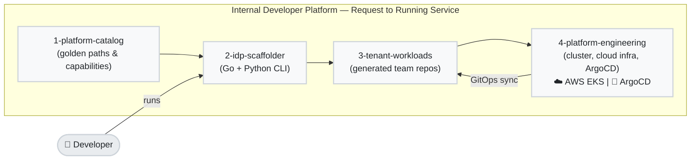
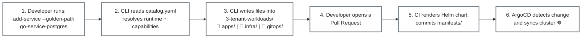
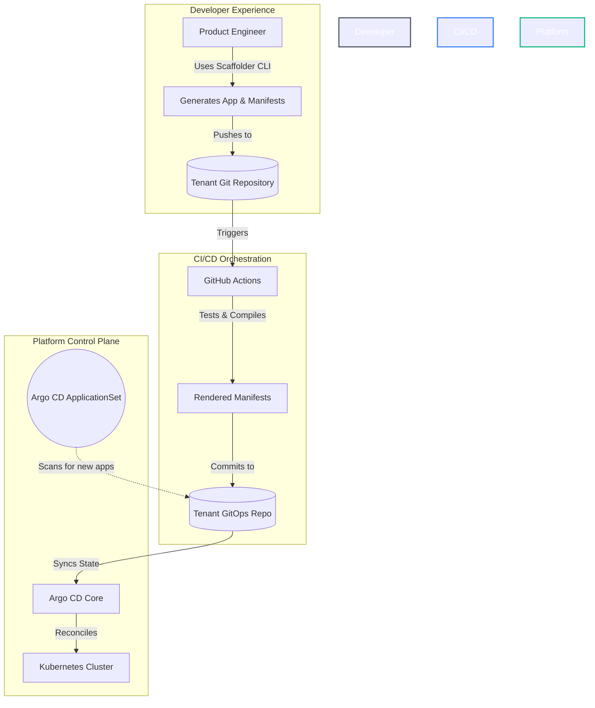
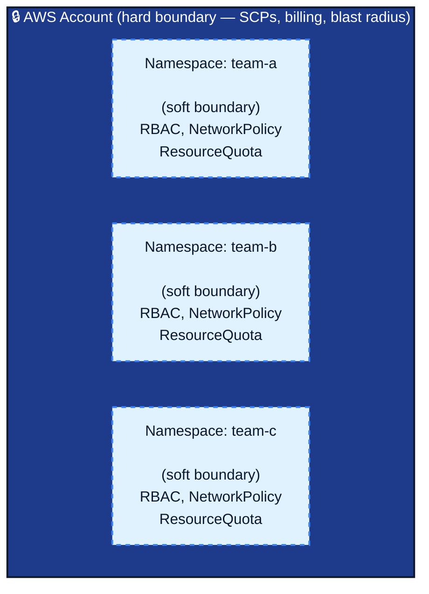

# 🏛️ Platform Engineering: IDP & GitOps Reference Architecture

[](https://github.com/ok-karthik/internal-developer-platform/releases/tag/v2.0.0)

**A self-service platform where a developer types one command and gets a running
microservice — with its own database, its own network policy, its own dashboards, and its
own place in the org's tenancy model — without filing a ticket.**

Built on **Platform-as-a-Product**: the platform is the product, application teams are its
customers. Four pillars deliver that:

| Pillar | What it means here |
|---|---|
| **UX** — Golden Paths | Curated, secure-by-default runtime + delivery templates a developer picks by name |
| **Self-service portal** | A CLI (Go, with a Python twin) that scaffolds a service in one command, no platform-team intervention |
| **Stable API** | Infrastructure is version-pinned Terraform modules and ArgoCD-managed manifests — never hand-edited |
| **Reconciliation engine** | GitOps: git is the source of truth, ArgoCD makes the cluster match it, always |

### System Overview



**Want the history of how this got built?** See [`PLAN.md`](PLAN.md) — a short changelog
of each build phase, in order.

---

## Contents

- [Repo Layout](#-repo-layout)
- [Quickstart — Run It Locally](#-quickstart--run-it-locally)
- [The Output Contract](#-the-output-contract)
- [How Requests Flow Through the Platform](#️-how-requests-flow-through-the-platform)
- [Multi-Tenancy: Two Layers of Isolation](#-multi-tenancy-two-layers-of-isolation)
- [Identity & Single Sign-On](#-identity--single-sign-on)
- [One Catalog, Two Engines](#-one-catalog-two-engines)
- [Component Matrix](#-component-matrix)
- [Cloud Portability](#️-cloud-portability)
- [Operations Guide](#️-operations-guide)
- [Known Limitations](#️-known-limitations)
- [Roadmap](#-roadmap)
- [Verification Checklist](#-verification-checklist)
- [Further Reading](#-further-reading)

---

## 📂 Repo Layout

```
internal-developer-platform/
├── 1-platform-catalog/        # WHAT THE PLATFORM OFFERS — golden paths, runtimes,
│                               #   capabilities, and catalog.yaml (the single source
│                               #   of truth both scaffolder engines read)
│
├── 2-idp-scaffolder/          # THE SELF-SERVICE CLI — two engines, one contract
│   ├── golang/                #   Go + Cobra — the definitive engine
│   └── python/                #   Python + Typer/FastAPI — same two verbs, same output
│
├── 3-tenant-workloads/        # THE GENERATED OUTPUT — what the CLI writes. One
│                               #   directory per team, simulating N teams' real repos
│                               #   in one monorepo (see docs/gitops-delivery.md)
│
└── 4-platform-engineering/    # THE PLATFORM ITSELF — cluster, cloud infra, addons
    ├── 1-cloud-foundation/    #   Terraform applied BEFORE a cluster exists (VPC, EKS, IAM)
    ├── 2-cluster-services/    #   ArgoCD-managed addons — ingress, observability, identity
    ├── 3-capability-modules/  #   Terraform modules tenants consume (postgres, s3, iam)
    └── 4-platform-apis/       #   Custom Kubernetes APIs (Crossplane compositions)
```

**One-sentence tour, in reading order:** a platform engineer edits `1-platform-catalog/`
→ a developer runs the CLI in `2-idp-scaffolder/` → their service lands in
`3-tenant-workloads/` → ArgoCD deploys it onto what `4-platform-engineering/` built.

**Each of the four top-level directories, and most of their subdirectories, has its own
`README.md`** with a one-line "what is this, who writes it, what consumes it" — read those
before diving into any one part.

---

## 🚀 Quickstart — Run It Locally

You can run this whole platform on your laptop with a local Kubernetes cluster (k3d). It
takes three commands.

```bash
make create-cluster    # spins up a local Kubernetes cluster
make install-argocd    # installs the GitOps engine
make bootstrap         # tells ArgoCD to deploy everything else
```

Or all three at once:

```bash
make setup
```

### Scaffold a service

Once the platform is running, generate a new microservice with one command:

```bash
cd 2-idp-scaffolder/golang

# Step 1 — once per team: creates the namespace, network policy, RBAC, etc.
go run . onboard-team --catalog-root ../../1-platform-catalog --team-name payments

# Step 2 — once per service: generates source code + deployment config
go run . add-service --catalog-root ../../1-platform-catalog \
                     --team-name payments --app-name checkout-api \
                     --golden-path go-service-postgres
```

`--golden-path` picks a pre-built combination of language + database + delivery config from
`catalog.yaml`. The Python engine exposes the identical two commands, plus a REST API:

```bash
cd 2-idp-scaffolder/python && uv sync
uv run python main.py onboard-team --team-name payments
uv run python main.py add-service --team-name payments --app-name checkout-api \
                      --golden-path go-service-postgres
make run-api      # FastAPI on the same engine; open /docs for the OpenAPI UI
```

> **Heads up:** without `--catalog-root`, the CLI fetches the catalog from GitHub instead of
> your local edits. Neither engine is idempotent yet — re-running `add-service` overwrites
> hand edits to a previously generated file (see [Known Limitations](#️-known-limitations)).

### Tear it down

```bash
make destroy
```

---

## 📜 The Output Contract

`1-platform-catalog/` has three parts, told apart by **what happens to the files inside**:

| Catalog directory | Rendered by | When | What reaches a tenant repo |
| :--- | :--- | :--- | :--- |
| `per-team/` | `onboard-team` | once per team | the files themselves, copied |
| `per-service/` | `add-service` | once per service (or once per capability requested) | the files themselves, copied |
| `charts/` | **GitHub Actions**, never the CLI | every push touching a `values.yaml` or the chart | **only its rendered output**, into `manifests/` |

The directory name tells you *how often* a thing renders — `per-team` vs `per-service` — and
the path underneath tells you *where it lands*. `per-service/` has a second split baked in:
`per-service/infra/capabilities/` is Terraform (applied by a `terraform` run), while
`per-service/gitops/capabilities/` is a Kubernetes-native alternative (applied by ArgoCD) —
which one a capability uses is a data field (`provisioner:` in `catalog.yaml`), not a coin
flip; see [Component Matrix](#-component-matrix) for why that distinction exists.

**The chart is the one exception, and it's worth calling out on its own:** nothing under
`charts/` is ever copied into a tenant repo. One platform-owned Helm chart serves every
service; CI runs `helm template` against each app's `values.yaml` and commits only the
plain-YAML result into `manifests/`. A chart fix therefore ships to every service at once
instead of being copy-pasted into N repos.

<details>
<summary><strong>Full destinations table</strong> (click to expand) — every catalog source, where it lands</summary>

| Catalog source | Rendered | Lands at |
| :--- | :--- | :--- |
| `per-team/apps/` | once per team | `<team>/apps/` |
| `per-team/infra/` | once per team | `<team>/infra/` |
| `per-team/gitops/` | once per team | `<team>/gitops/` |
| `per-service/apps/runtimes/<lang>/` | per service | `<team>/apps/<app>/` |
| `per-service/apps/service-meta/` | per service | `<team>/apps/<app>/` |
| `per-service/infra/capabilities/<cap>.tf.tmpl` | per capability, if `provisioner: terraform` | `<team>/infra/apps/<app>/<env>/` |
| `per-service/gitops/capabilities/<cap>.yaml.tmpl` | per capability, if `provisioner: ack` | `<team>/gitops/apps/<app>/<env>/` |
| `per-service/gitops/release/` | per service | `<team>/gitops/apps/<app>/<env>/` |
| `charts/service/` | **never scaffolded** | CI renders it into `<team>/gitops/apps/<app>/<env>/manifests/` |

Every row is the literal `destinations:` block in `catalog.yaml` — the CLI reads that same
data to decide where to write, so this table cannot drift from the code.
</details>

<details>
<summary><strong>See it run</strong> (click to expand) — one real command, full output</summary>

```console
$ make demo-add-service DEMO_TEAM=payments DEMO_APP=checkout-api

Generating app 'checkout-api' [Runtime: go, Capabilities: [postgres]]
per-service/apps/runtimes/go/go.mod.tmpl           --> payments/apps/checkout-api/go.mod
per-service/apps/runtimes/go/main.go.tmpl          --> payments/apps/checkout-api/main.go
per-service/apps/service-meta/catalog-info.yaml.tmpl --> payments/apps/checkout-api/catalog-info.yaml
per-service/gitops/release/values.yaml.tmpl        --> payments/gitops/apps/checkout-api/dev/values.yaml
Adding infrastructure capability: postgres (provisioner: terraform)
per-service/infra/capabilities/postgres.tf.tmpl    --> payments/infra/apps/checkout-api/dev/postgres.tf
```

Five files, three would-be repos, one command. Note what is absent: no `Chart.yaml`, no
Helm packaging in `apps/`, and nothing written outside `dev/` — production requires a
deliberate promotion PR.

The CLI writes to the current directory and appends nothing to it, same contract as
`terraform` or `npm`. See [`docs/gitops-delivery.md`](docs/gitops-delivery.md) for how the
generated monorepo layout turns into real per-team repos with no extra tooling.
</details>

---

## 🗺️ How Requests Flow Through the Platform



Kubernetes is the source of truth for *desired* state, and git is the source of truth for
*everything* — ArgoCD's only job is making the cluster match what git says, continuously.



Nobody hand-maps new services to ArgoCD `Application` objects. Discovery is automatic and
two-level: one platform-wide watcher notices each team's config, and each team's own watcher
notices that team's apps — so a new service just needs its files to exist in git, nothing
registered by hand.

---

## 🔐 Multi-Tenancy: Two Layers of Isolation



> **In plain terms:** namespaces keep well-behaved teams from tripping over each other.
> AWS accounts keep a genuinely bad actor — or a genuinely bad mistake — from reaching
> anyone else's data or bill. This platform uses **both**, for two different jobs.

**Layer 1 — namespaces (one per team, all in the same cluster).** Every team gets its own
Kubernetes namespace with a full set of guardrails: what ArgoCD may deploy there, what
network traffic is allowed in and out, how much CPU/memory/storage the team can consume,
and what a human can do with `kubectl` (read and view logs — no writes; changes go through
git). This is enough for teams that are cooperating, not attacking each other, which
describes almost every company that will ever run a platform like this.

**What namespaces don't protect against:** every team still shares the same underlying
Linux kernel, the same Kubernetes control plane, and the same physical nodes. That's fine
for internal teams. It's not a real security boundary against a hostile tenant — running
untrusted third-party code needs something stronger (options exist, from cheapest to most
isolated: dedicated node pools → gVisor/Kata sandboxing → a virtual control plane per
tenant → fully separate clusters — none of them are justified below roughly 1,000
engineers, so none are built here).

**Layer 2 — AWS accounts (one per environment, e.g. dev vs. prod).** This is the boundary
that actually matters if something goes seriously wrong: separate billing, separate IAM,
separate blast radius. A misconfigured `dev` account cannot page anyone in `prod`, because
they're not the same account. The common real-world shape — and what this platform
uses — is **one account per environment, with every team's namespace living inside it**,
not one account per team and not one shared account for everything.

The mechanism is **AWS Organizations** with **Service Control Policies (SCPs)**. The one
thing worth understanding about SCPs: they're a *ceiling*, not a grant — an SCP can't give
anyone permission to do anything, it can only cap what's allowed, even for the account's
own root user. That's what makes an account boundary "hard" where a namespace's
`NetworkPolicy` is "soft": nothing running inside the account, however privileged, can
switch an SCP off. Real Terraform for this — two environment OUs and three SCPs (deny
leaving the org, deny disabling the audit trail, deny regions outside the EU) — lives in
[`4-platform-engineering/1-cloud-foundation/aws/organization/`](4-platform-engineering/1-cloud-foundation/aws/organization/).

**Requesting a new team and requesting a new AWS account use the same pattern, one level
apart:** both are a git-reviewed request that produces a fully governed unit — policies
already attached, nothing clicked by hand.

| Step | New team (namespace) | New AWS account |
|---|---|---|
| Request | `--team payments` | a pull request |
| Baseline applied | network policy, quota, pod security | audit logging, SCPs |
| Registration | ArgoCD picks it up automatically | joins the AWS Organization |

**Connecting the two layers for AWS access:** when a controller running in the cluster
needs to create real AWS resources (a database, a bucket) for one specific team, the chain
is `namespace → that pod's own AWS credentials → a role in the team's own AWS account`. The
team's account only ever trusts a narrow, revocable request from the cluster — never the
other way around. Details:
[`ack-cross-account.tf`](4-platform-engineering/1-cloud-foundation/aws/organization/ack-cross-account.tf).

---

## 🔐 Identity & Single Sign-On

Every rule above ("team-a can only touch team-a's namespace") only means something if
there's a real login system deciding who *is* team-a. This platform runs
[Keycloak](https://www.keycloak.org/) as a stand-in for a corporate login system (Entra ID,
Okta, or similar), and wires the same group membership into five different tools —
Kubernetes, ArgoCD, Grafana, Backstage, and AWS — so one group decides access everywhere,
not five separate systems that can drift apart.

**Full write-up, with the verification commands and the AWS production path:**
[`docs/identity-and-sso.md`](docs/identity-and-sso.md)

---

## 🔬 One Catalog, Two Engines

Most reference architectures claim their catalog is "the contract" and leave it at that. Here the claim is **falsifiable**.

`1-platform-catalog/catalog.yaml` is consumed by two independent implementations — Go (`text/template`, Cobra) and Python (Jinja2, Typer, pydantic). Run both with the same inputs and diff the trees:

```bash
diff -r /tmp/go-out/3-tenant-workloads/payments 3-tenant-workloads/payments
```

If the output differs, one of two things is true: the engines have drifted, or the catalog is under-specified about something both had to guess. Both are findings worth having. **Today the two trees are byte-identical** — every file, both verbs.

This is also why the templates carry no logic beyond one conditional, why output paths live in `catalog.yaml`'s `destinations:` table rather than in either codebase, and why both engines validate the same required keys at load time. A contract that only one implementation reads is just a config file.

> Two engines is a deliberate teaching choice, not a production recommendation. In a real platform you would ship one and spend the saved effort on Day-2 concerns — `--dry-run`, idempotent regeneration, catalog version pinning. Those are exactly the items in the two `TODO.md` files.

---

## 🧰 Component Matrix

This blueprint integrates best-in-class cloud-native tooling to form a cohesive ecosystem:

| Capability | Technology | Architectural Purpose |
| :--- | :--- | :--- |
| **Local Cluster** | **K3d (K3s)** | Lightweight, ephemeral Kubernetes environment optimized for ARM64/Silicon. |
| **GitOps Engine** | **Argo CD** | Declarative CD, state reconciliation, and multi-tenant auto-discovery. |
| **Infra as Code** | **Terraform** | Version-pinned modules (`4-platform-engineering/3-capability-modules/aws/`), claimed per-capability via `catalog.yaml` and scaffolded into each service's `infra/apps/<app>/<env>/`. |
| **Policy as Code** | **Kyverno** | Admission control. Enforces cluster security boundaries and standards. |
| **Prog. Delivery** | **Argo Rollouts** | Automated Canary & Blue-Green deployments integrated with edge routing. |
| **Edge Gateway** | **Traefik** | L7 ingress, API gateway, rate-limiting, and middleware injection. |
| **Secrets Ops** | **Sealed Secrets** | Asymmetric encryption enabling safe storage of secrets in Git. |
| **Observability** | **Grafana Stack**| Unified metrics (Prometheus), logs (Loki), and traces (Tempo) — plus SLO-based, multi-window multi-burn-rate alerting on `app-a` routed through Alertmanager, each alert linked to a runbook (`4-platform-engineering/2-cluster-services/observability/slo/`, `docs/runbooks/`). |
| **Dep. Management**| **Renovate** | Automated dependency bumps. `go.mod` and `pyproject.toml` are covered by the built-in managers; one custom regex manager handles the version pins in `catalog.yaml`, which no package manager understands. |
| **DORA Metrics** | **Grafana dashboard** | Deployment frequency and change failure rate as real PromQL against ArgoCD's own sync metrics (`4-platform-engineering/2-cluster-services/observability/dora-dashboard.json`); lead time and MTTR are documented gaps, not faked ones — see the dashboard's own panels. |

**Why measure deployment stats at all?** "How do you know your platform is working?" is a
question most engineers answer with a story instead of a number. Two of the four DORA
metrics above (change failure rate, MTTR) are only computable *because* the SLO alerting
in the Observability row exists — without an alert that fires on a bad deploy, there's no
signal to count a deploy as "failed." That's the concrete reason alerting had to be built
before the dashboard that measures it.

---

## ☁️ Cloud Portability

This platform targets AWS. It does not run on multiple clouds, and it never claims to —
what it does instead is prove that **one piece of it could move**, and name exactly what
would have to change if the rest ever needed to.

| Layer | Portable to another cloud? | Why |
|---|---|---|
| Helm chart, ArgoCD, Kyverno, observability stack, Argo Rollouts, ESO | ✅ Yes | Plain Kubernetes — runs on any conformant cluster |
| Capability *names* in `catalog.yaml` (`postgres`, `s3`) | ✅ Yes | Already provider-neutral |
| Terraform modules under `3-capability-modules/<provider>/` | ❌ No | Provider-specific by definition |
| The cluster itself (EKS/AKS/GKE) | ❌ No | Different node groups, networking, identity per cloud |
| **ACK** (the AWS controller that provisions S3 buckets, IAM roles, etc.) | ❌ **No — hard blocker** | AWS-only; no equivalent exists for Azure. Crossplane would have to replace it entirely if this ever mattered |
| Pod Identity / IRSA (workload → cloud credentials) | ❌ No | Azure and GCP have their own equivalents, but the configuration doesn't carry over — only the concept does |

**The proof:** [`4-platform-engineering/3-capability-modules/azure/postgres/`](4-platform-engineering/3-capability-modules/azure/postgres/)
is a second implementation of the `postgres` capability, on Azure, with the *exact same*
inputs and outputs as the AWS version — you can diff the two files to check this claim
rather than take it on faith. Because the cloud provider is just a piece of a file path in
`catalog.yaml` (not hardcoded anywhere), switching the whole platform's database capability
to Azure would be a one-line change. **`catalog.yaml` still points at AWS** — this module
exists to prove the swap is *possible*, not to actually make it.

---

## 🛠️ Operations Guide

### Updating ArgoCD Applications
If you make changes to the YAML files inside the `4-platform-engineering/` directory, ArgoCD is configured to automatically sync the changes from the `main` branch.
To manually trigger a sync or force an update without waiting for Git polling, you can apply the bootstrap file again:
```bash
make bootstrap
```
Or force a sync via the ArgoCD CLI:
```bash
argocd app sync platform-bootstrap
```

### Tearing Down the Cluster
To delete the ephemeral cluster and completely destroy the environment, run:
```bash
make destroy
```
This will remove the cluster (via K3d/Kind/Minikube) and clean up all resources.

---

## ⚠️ Known Limitations

Named here in one place, deliberately, rather than scattered through the codebase where
they'd be easy to miss.

- **Infrastructure requests don't provision anything yet.** `add-service --capabilities
  postgres` writes a Terraform file into the tenant repo, but nothing in this repo ever
  runs `terraform apply` against it. CI only builds images and renders Helm templates —
  there's no Terraform runner, no state backend, no plan/apply gate. Application delivery
  (the GitOps path) is a closed loop; infrastructure delivery is not. Closing this needs
  either a real Terraform runner (plan on PR, apply on merge) or moving cheap/recreatable
  capabilities onto a continuously-reconciling controller (which is what the ACK path
  already does for S3 and IAM).
- **Neither scaffolder engine is idempotent.** Re-running `add-service` overwrites any hand
  edits made to a previously generated file. A "skip if exists" mode and a working
  `--dry-run` flag are the next items on both engines' `TODO.md`.
- **Observability alerts assume a metrics pipeline that isn't fully wired.** Traces reach
  Tempo automatically; metrics don't yet reach Prometheus the same way (that needs an
  OpenTelemetry Collector + a `ServiceMonitor`, not yet built), so the burn-rate alerts in
  `4-platform-engineering/2-cluster-services/observability/slo/` are correct but currently
  have nothing to fire on.
- **The scaffolder CLI has no login of its own.** Anyone who can run the binary can
  scaffold into any team's directory — the pull request + `CODEOWNERS` review is the real
  gate today. See [Roadmap](#-roadmap) for the planned fix (reusing the same Keycloak
  groups the rest of the platform already uses).
- **This has not been run against a real AWS account.** Every piece of Terraform under
  `4-platform-engineering/1-cloud-foundation/` and `3-capability-modules/` is held to a
  clean `terraform plan`, not an actual `apply`. A green local (`k3d`) run also does not
  exercise real IAM, load balancers, storage, or cluster authentication — those only get
  tested against a real cluster.

---

## 🔮 Roadmap

Not yet built, in rough priority order. Full history of what *is* built: [`PLAN.md`](PLAN.md).

- [ ] **Scaffolder login.** Wire the CLI and REST API into the same Keycloak groups that
  already drive Kubernetes RBAC and ArgoCD — so scaffolding into a team's directory
  requires being a member of that team, not just knowing the binary exists. Design notes:
  [`.agents/AGENTS.md`](.agents/AGENTS.md#-roadmap--scaffolder-identity-not-planned-work-direction-only).
- [ ] **A real Backstage instance.** `docs/backstage/` has the design and a working
  template for how Backstage would call this platform's CLI instead of reimplementing it —
  standing up the actual TypeScript app is separate, larger work.
- [ ] **Finish the metrics pipeline** so the SLO alerts in Known Limitations have real data
  to evaluate, and extend deployment-dependency mapping across more than one service.
- [ ] **FinOps automation** — scale non-production workloads to zero outside working hours
  using KEDA.

---

## ✅ Verification Checklist

<details>
<summary><strong>Static checks</strong> — no cluster required</summary>

```bash
# Every manifest still parses
find 3-tenant-workloads 4-platform-engineering -name '*.yaml' \
  -exec kubectl apply --dry-run=client -f {} \; 2>&1 | grep -i error

# The chart still renders and lints
helm lint 1-platform-catalog/charts/service
helm template app-a 1-platform-catalog/charts/service \
  -f 3-tenant-workloads/team-a/gitops/apps/app-a/dev/values.yaml

# Templates and rendered output agree (expect only [[ .TeamName ]] -> team-a)
diff <(sed 's/\[\[ \.TeamName \]\]/team-a/g' \
        1-platform-catalog/per-team/gitops/platform/team/namespace.yaml.tmpl) \
     3-tenant-workloads/team-a/gitops/platform/team/namespace.yaml

# Burn-rate alert PromQL is syntactically valid
promtool check rules 4-platform-engineering/2-cluster-services/observability/slo/app-a-alerts.yaml

# Terraform: every module validates independently
for d in 4-platform-engineering/1-cloud-foundation/aws/* 4-platform-engineering/3-capability-modules/*/*; do
  terraform -chdir="$d" init -backend=false >/dev/null && terraform -chdir="$d" validate
done
tflint --recursive 4-platform-engineering/

# Tier 2 — the check that actually proves something against real AWS APIs. Creates nothing.
terraform -chdir=4-platform-engineering/1-cloud-foundation/aws/cluster plan
```
</details>

<details>
<summary><strong>Live cluster checks</strong> — after <code>make setup</code> + <code>make wait-for-apps</code></summary>

```bash
kubectl auth can-i --list --as=system:serviceaccount:team-a:default -n team-a
kubectl describe resourcequota -n team-a
kubectl get networkpolicy -n team-a          # expect 5 named policies
```

**A green `kubectl`/`helm` run on k3d does not mean the platform works against real AWS.**
IAM, load balancers, storage, and cluster authentication are only genuinely tested by a
`terraform plan` (or a real account), never by the local cluster alone.
</details>

---

## 📚 Further Reading

- [`PLAN.md`](PLAN.md) — what was built, in order, one short entry per phase
- [`docs/identity-and-sso.md`](docs/identity-and-sso.md) — the full identity system write-up
- [`docs/gitops-delivery.md`](docs/gitops-delivery.md) — monorepo-to-polyrepo delivery, explained
- [`docs/adr/001-tools-evaluated.md`](docs/adr/001-tools-evaluated.md) — tools considered and not adopted, with the reasoning
- [`docs/backstage/`](docs/backstage/) — the Backstage integration design (not yet a running instance)
- [`docs/runbooks/`](docs/runbooks/) — incident response runbooks, one per alert
- [`.agents/AGENTS.md`](.agents/AGENTS.md) — the full technical reference: conventions, decisions, execution commands
