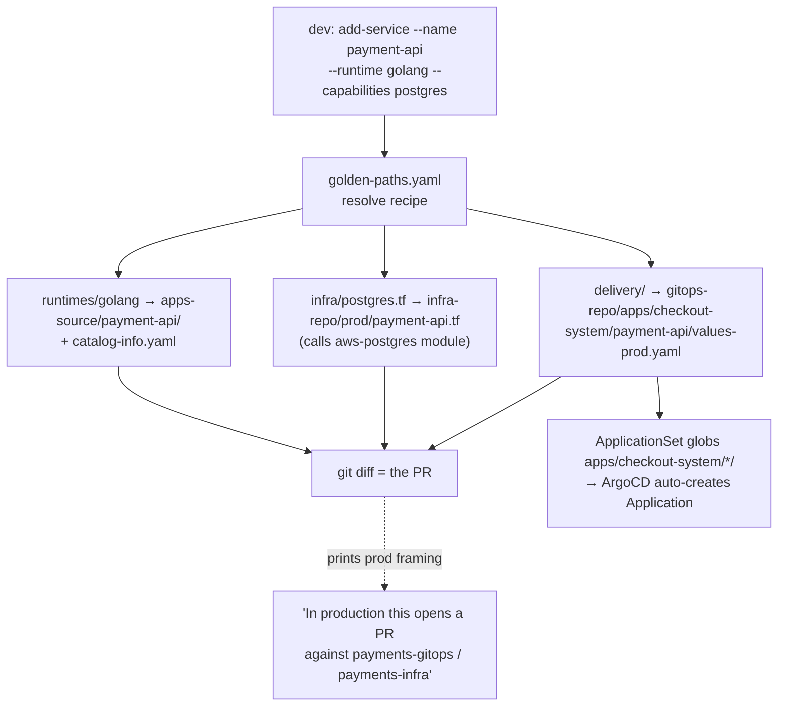
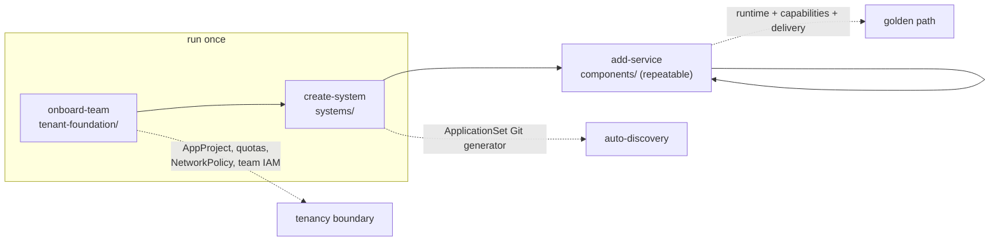

# Design: IDP Scaffolder Template Restructuring & Platform Upgrades

- **Status:** Templates restructured; Go/Python CLI implementation pending
- **Date:** 2026-07-29
- **Author:** Karthik Orugonda
- **Scope:** `1-idp-scaffolder-templates/` layout + `2-idp-scaffolder-golang/` CLI verbs
- **Non-goals:** rewriting the Python scaffolder; building a real multi-repo Git topology; introducing Kustomize

---

## 1. Motivation

The current scaffolder is a **monolithic team generator**: one `create --app-name --team-name` command renders an entire tenant tree in one shot. That is fine as a demo, but it does not reflect how mature platform teams actually operate, and it hides the concepts that matter most in platform engineering: tenancy boundaries, golden paths, capability-based infrastructure, and GitOps auto-discovery.

This redesign moves the templates from *"a pile of folders a generator copies"* into **a capability-driven platform model organised around the verbs a platform actually offers**. The goal is production fidelity — the layout and flows should mirror how real orgs do this, so the repository doubles as a learning artifact and a portfolio piece.

### The layering that drives everything

The single most important framing: the template **source** is a different layer from the runtime **topology** it generates. Keeping these straight is what most tutorials get wrong.

| Layer | Where it lives | What it is |
|---|---|---|
| Template source (golden paths) | `1-idp-scaffolder-templates/` | The paved-road definitions |
| Generator | `2-idp-scaffolder-golang/` (definitive) | Renders templates → output |
| Generated tenant output | `3-tenant-workloads/` | Simulates the real tenant repos (git-tracked) |
| Platform control plane | `4-platform-engineering/` | Cluster add-ons, TF modules, ArgoCD ApplicationSets |

---

## 2. The organising principle: lifecycle verbs

A scaffolder is fundamentally **a set of operations**, so its templates are organised by the operations a platform offers — not by file type. Three verbs, three distinct idempotency contracts:

| Verb | Frequency | Idempotency | Produces |
|---|---|---|---|
| `onboard-team` | once per team | create-once | the tenancy boundary (guardrails) |
| `create-system` | once per logical system | create-once per system | an App-of-Apps / ApplicationSet |
| `add-service` | frequently | repeatable (a reviewable change) | a new microservice across src/infra/gitops |

---

## 3. Target layout for `1-idp-scaffolder-templates/`

```
1-idp-scaffolder-templates/
├── README.md                       # the model + the production repo mapping (see §7)
├── golden-paths.yaml               # catalog: each path = runtime + capabilities + delivery
│
├── tenant-foundation/              # verb: onboard-team  (once)  — THE TENANCY BOUNDARY
│   ├── gitops-base/
│   │   ├── appproject.yaml.tmpl        # ArgoCD AppProject: allowed repos/destinations/cluster resources
│   │   ├── namespace.yaml.tmpl         # Namespace + ResourceQuota + LimitRange
│   │   ├── networkpolicy.yaml.tmpl     # baseline default-deny
│   │   └── CODEOWNERS.tmpl
│   └── infra-base/
│       ├── providers.tf.tmpl           # AWS provider + remote state backend
│       └── team-iam.tf.tmpl            # team IAM role with IRSA/OIDC trust
│
├── systems/                        # verb: create-system
│   └── app-of-apps/
│       └── applicationset.yaml.tmpl    # Git generator globbing apps/[[ .SystemName ]]/*/
│
└── components/                     # verb: add-service  (a reviewable change per §6)
    ├── runtimes/                       # source boilerplate — the "src"
    │   ├── golang/  python/  nodejs/  springboot/
    ├── infra/                          # capability claims that CALL 4-platform modules
    │   ├── postgres.tf.tmpl            #   capability: postgres  → module aws-postgres
    │   ├── s3.tf.tmpl                  #   capability: s3        → module aws-s3
    │   └── ...
    ├── delivery/                       # ArgoCD Application values (Helm)
    │   ├── values-dev.yaml.tmpl
    │   └── values-prod.yaml.tmpl
    └── catalog-info.yaml.tmpl          # Backstage portal self-registration
```

**Reading the layout:** the top level is **platform verbs**; `tenant-foundation/` is the **tenancy boundary**; `systems/` provides **auto-discovery**; `components/` holds the **capability-driven golden paths**. A reviewer reads the folder names and gets the model.

> **Naming note:** `golden-paths.yaml` (our internal catalog of paved roads) is deliberately *not* named `catalog.yaml`, to avoid confusion with `catalog-info.yaml` (the Backstage per-component standard). Two different files, two different jobs.

---

## 4. The five principal-level upgrades

### 4.1 `add-service` is a reviewable change, not an in-place write
Mature platforms open a **Pull Request** against the team repo rather than mutating it — preserving review gates, CODEOWNERS, and audit trail. In this reference architecture we simulate that with git itself: the CLI writes into the git-tracked `3-tenant-workloads/` tree, and **the resulting `git diff` *is* the PR** (see §5, decision D2). No merge engine, no staging directory — maximally honest.

### 4.2 Services are *discovered*, not *registered*
`add-service` touches **no** root App-of-Apps file. `create-system` drops an ArgoCD **ApplicationSet** with a Git generator globbing `apps/<system>/*/`; when a new service directory lands, ArgoCD creates its Application automatically. This is convention-over-configuration — the thing that makes a platform feel automatic. (`4-platform-engineering/` already contains an `applicationset-tenant-apps.yaml` to build on.)

### 4.3 `tenant-foundation` is where tenancy is proven
The guardrail bundle a platform team owns:
- ArgoCD `AppProject` — whitelist of source repos, destination namespaces, cluster-scoped resources (deploy blast radius)
- `Namespace` + `ResourceQuota` + `LimitRange` + baseline default-deny `NetworkPolicy`
- Team IAM role with **IRSA/OIDC trust** (scoped role assumption, no static creds)
- `CODEOWNERS` + Kyverno policy binding (Kyverno already lives in `4-platform-engineering/`)

This bundle *is* the paved road with guardrails — the most credible security story in the repo.

### 4.4 Infrastructure is requested as *capabilities*, not raw Terraform
A golden path declares **what the service needs** (`capabilities: [postgres]`), and the platform maps that claim to its **blessed** Terraform module in `4-platform-engineering/cloud-services-terraform-modules/`. Developers request capabilities; the platform owns provisioning. This is the claims/capabilities pattern (cf. Crossplane claims, [score.dev](https://score.dev)).

### 4.5 Every service ships a portal manifest
`add-service` generates a `catalog-info.yaml` (Backstage) so the component self-registers with its owner, system, and links — closing the loop between *scaffolded* and *discoverable*.

---

## 5. Key decisions

- **D1 — Go is the definitive implementation.** The three verbs are built only in `2-idp-scaffolder-golang/` (Cobra). Implementing them twice is pure tax with no learning upside. `2-idp-scaffolder-python/` stays as-is, documented as the legacy/reference implementation.
- **D2 — git-as-PR.** The CLI writes generated files into the git-tracked `3-tenant-workloads/` tree and prints the production framing (*"in production this opens a PR against `payments-gitops`"*). The user inspects `git diff` / `git add -p` to see exactly what the PR would contain. No `staging/` dir, no patch tooling.
- **D3 — monorepo output, polyrepo mapping documented.** Everything lands under `3-tenant-workloads/<team>/{apps-source,infra-repo,gitops-repo}/`. Production repo names are documented in the README (§7), not real output paths.
- **D4 — Helm only.** `delivery/` is Helm values. No Kustomize — one paved road.
- **D5 — `golden-paths.yaml` is the source of truth** for capability → TF-module mapping, consumed by `add-service`.

---

## 6. Worked golden path: Go service + Postgres

The concrete trace that makes the model tangible. A developer adds a Go API needing a database:

```bash
# run from 2-idp-scaffolder-golang/
go run . add-service \
  --name payment-api \
  --system checkout-system \
  --team payments \
  --runtime golang \
  --capabilities postgres
```

**Step 1 — source** (`runtimes/golang/`): renders
`3-tenant-workloads/payments/apps-source/payment-api/` with Go boilerplate + a
`catalog-info.yaml` registering component `payment-api`, owner `team-payments`, system `checkout-system`.

**Step 2 — infra as capability** (`infra/postgres.tf.tmpl`): drops
`3-tenant-workloads/payments/infra-repo/prod/payment-api.tf` consuming the blessed module — *not* raw RDS resources:

```hcl
module "postgres" {
  source   = "git::https://github.com/ok-karthik/platform-engineering-idp-gitops-reference-architecture.git//4-platform-engineering/cloud-services-terraform-modules/aws-postgres?ref=v1.0.2"
  app_name = "payment-api"
  team     = "payments"
}
```

**Step 3 — delivery** (`delivery/`): drops
`3-tenant-workloads/payments/gitops-repo/apps/checkout-system/payment-api/values-prod.yaml`.
It does **not** modify any App-of-Apps root file.

**Step 4 — discovery** (no generation): the `ApplicationSet` created during `create-system` globs
`apps/checkout-system/*/`, discovers `payment-api/`, and ArgoCD creates the Application dynamically.

**Step 5 — the "PR":** `git -C 3-tenant-workloads status` shows exactly the change set a developer would open as a PR against the team repos.

### Add-service flow



### Lifecycle verbs at a glance



---

## 7. Production repo mapping (for the README)

> On disk, everything lands under `3-tenant-workloads/<team>/{apps-source,infra-repo,gitops-repo}/`.
> In production, each of those folders is a **standalone Git repository** under a department subgroup:
>
> | Reference architecture (monorepo) | Production repo |
> |---|---|
> | `3-tenant-workloads/payments/apps-source/payment-api/` | `acme-corp/department-payments/checkout-api-src` |
> | `3-tenant-workloads/payments/infra-repo/` | `acme-corp/department-payments/payments-infra` |
> | `3-tenant-workloads/payments/gitops-repo/` | `acme-corp/department-payments/payments-gitops` |
>
> This reference architecture collapses them into one runnable monorepo for demonstration; `add-service` writes files locally, and in production the same step opens a PR against the corresponding repo.

---

## 8. Example `golden-paths.yaml`

```yaml
golden_paths:
  go-service-postgres:
    description: Go microservice backed by AWS Postgres, shipped via ArgoCD
    runtime: golang
    capabilities: [postgres]        # → aws-postgres TF module
    delivery: standard-helm
  python-worker-s3:
    description: Python worker with an S3 bucket
    runtime: python
    capabilities: [s3]              # → aws-s3 TF module
    delivery: standard-helm

# capability → blessed platform module
capabilities:
  postgres: aws-postgres
  s3:       aws-s3
  iam:      aws-iam
```

---

## 9. Implementation outline

1. Restructure `1-idp-scaffolder-templates/` into the §3 layout (move `apps-source/` → `components/runtimes/`; split `tenant-template/` into `tenant-foundation/` + `systems/` + `components/{infra,delivery}`).
2. Author `tenant-foundation/` guardrail templates (AppProject, namespace/quota/NetworkPolicy, team IAM, CODEOWNERS).
3. Author `systems/app-of-apps/applicationset.yaml.tmpl`.
4. Add `golden-paths.yaml` + `components/catalog-info.yaml.tmpl`.
5. Grow the Go CLI (`cmd/cli/`) from `create` into `onboard-team`, `create-system`, `add-service`; `add-service` reads `golden-paths.yaml` to resolve runtime + capabilities + delivery.
6. Update `.agents/AGENTS.md` + top-level `README.md` (production mapping, new verbs).
7. Regenerate `3-tenant-workloads/` sample tenants from the new templates end-to-end.

---

## 10. Resolved items

- **Exact ArgoCD `AppProject` restriction set:** We will start extremely strict. `sourceRepos` restricted to the tenant's `*-gitops` repo. `destinations` restricted to the tenant's specific namespaces. `clusterResourceWhitelist` empty by default (platform provisions namespaces).
- **ApplicationSet location:** `create-system`'s ApplicationSet will live in the tenant's `gitops-repo`. This empowers tenants to manage systems, safely constrained by the strict `AppProject` boundaries generated during onboarding.
- **Seed first empty `system` during `onboard-team`:** No. We keep the verbs strictly composable and distinct to enforce the conceptual separation between onboarding a team and creating a logical system topology.
